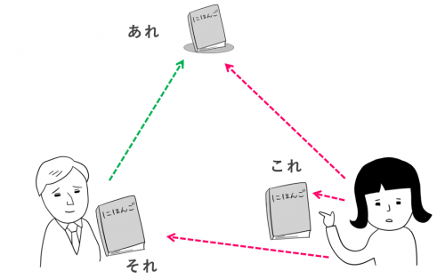

---
# 这是文章的标题
title: 日语语法：新标日的初上第2课
# 这是页面的图标
icon: page
# 这是侧边栏的顺序
order: 1
# 设置作者
# 设置写作时间
date: 2023-02-12
# 一个页面可以有多个分类
category:
  - 外语学习
# 一个页面可以有多个标签
tag:
  - 日本语
  - 语法
# 此页面会在文章列表置顶
sticky: false
# 此页面会出现在文章收藏中
star: true

---

## 代词的使用：これ/それ/あれは～です

　　これ/それ/あれ/どれ：(事物性指示代词，一般用于指代物或事)这个/那个/那个/哪个。

　　- これ 距离说话人近，听话人远的物体。

　　- それ 距离说话人远，听话人近的物体。

　　- あれ 距离说话人和听话人都远的`物体。

　　- どれ 询问哪个?

### 例句
　　だれですか。/何ですか。

　　出现针对性的特殊疑问词的疑问句叫做特殊疑问句，句末仍要用「か」来表示疑问。回答针对特殊疑问词作出相应具体回答即可。

　　例1：これは何ですか。——それは本です。

　　例2：あの人は誰ですか。——田中さんです。

## 连体 この/その/あの～は～です

　　この/その/あの/どの：(连体词，具体指代内容是由后项连接的体言所决定。
　　- 可指代事物、地点、人物、方向等)。
　　- 位置关系和 これ/それ/あれ/どれ一样。
　　
　　
::: tip note
　　连体不能单独使用
:::

