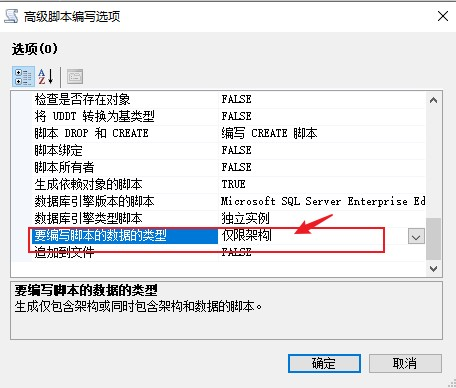
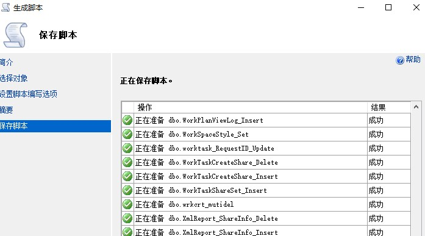
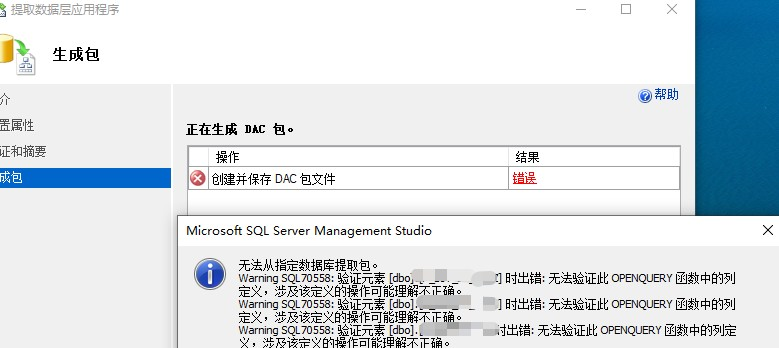

---
# 这是文章的标题
title: SQL Server：技巧：如何复制数据库表结构（不带数据）
# 这是页面的图标
icon: page
# 这是侧边栏的顺序
order: 45
# 设置作者
# 设置写作时间
date: 2023-07-07
# 一个页面可以有多个分类
category:
  - 数据库
  - database
  - 原创

# 一个页面可以有多个标签
tag:
  - mssql
  - 效率工具
  - sqlserver


# 此页面会在文章列表置顶
sticky: false
# 此页面会出现在文章收藏中
star: true

---


## 前言 

需求：有时需要根据现有数据库部署一个新数据库，新数据库要求同样的表结构和数据库对象，但不要有任何数据。在SQL Server里有集中方法。


## 方法一：使用DBCC CLONEDATABASE指令

> 推荐方法。自SQL Server 2016起，支持使用`DBCC` 来克隆一个不带任何数据的数据库结构。微软初衷是提供该指令来做数据库问题诊断和性能调优。

### 准备
- SQL server 数据库管理员账户
- 使用SQL Serve Management Studio (SSMS) 18.x

### 使用举例

- 克隆一个数据库结构（不带数据，不带统计信息），执行：
```sql 
DBCC CLONEDATABASE (mydb, mydb_Clone) WITH NO_STATISTICS, NO_QUERYSTORE,VERIFY_CLONEDB;
GO
```

**说明**

- 其中 `mydb` 是源数据库名，`mydb_Clone`目标数据库名（数据库名可以自取）。
- 使用了`VERIFY_CLONEDB`命令选项，使得克隆出来的数据库会被验证，可用到生产环境；
- 执行时间视源数据库大小而定。一个200GB的数据库，大约使用1-2分钟克隆出一个空数据库。
- 如果顺利执行，一个新的数据库`mydb_Clone`将在当前数据库服务器上创建，只有数据库结构(Schema)，并且是**只读**状态。
- 如果顺利执行，将输出以下类似内容：
```
---
已在 VERIFY_CLONE 中启用 NO_STATISTICS 和 NO_QUERYSTORE 选项。
已开始对“mydb”执行数据库克隆操作，目标为“mydb_Clone”。
已完成对“mydb”的数据库克隆。克隆数据库为“mydb_Clone”。
数据库“mydb_Clone”是克隆的数据库。
克隆数据库验证已通过。
DBCC 执行完毕。如果 DBCC 输出了错误信息，请与系统管理员联系。

完成时间: 2023-07-07T09:41:14.6053740+08:00
```

:::warning 警告
微软官方不对这种克隆数据库提供技术支持。
:::

:::note 注意
使用`DBCC CLONEDATABASE`使用数据库内部快照,克隆架构过程会在源数据库上使用数据库级别的锁，可考虑在非业务高峰上操作。
:::

:::tip 
新数据库将在源数据库所在的数据库服务器上创建,且是只读状态。如果需要把克隆出来的新数据库迁移到其他数据库,可以使用数据库备份还原或是其他方法
:::

更多`DBCC CLONEDATABASE`例子 点击 [这里](https://learn.microsoft.com/en-us/sql/t-sql/database-console-commands/dbcc-clonedatabase-transact-sql?view=sql-server-ver16)


## 方法二：使用Create Scripts

> 一般方法, 适用于较低版本的SQL。把源数据库当前架构和数据库对象生成脚本，然后在目标数据库服务器上执行脚本创建数据库。

### 准备
- SQL server 数据库管理员账户
- 使用SQL Serve Management Studio (SSMS) 

### 使用举例

- 选择目标数据库，右键【任务/Task】。
- 选择【生成脚本...】
- 在【生成脚本】向导中，选择【为整个数据库及所有数据库对象编写脚本】
- 在【生成脚本】的【设置脚本编写选项】中，点击【高级】，确认脚本类型是`仅限架构`,如下图：


- 指定脚本文件保存位置。
- 脚本生成执行过程，如下图：


- 在目标数据库服务器上，执行该脚本即可。脚本将在目标服务器上创建一个同名数据库和同样数据库文件结构。可以修改匹配目标服务器环境。

## 方法三：使用DACPAC 或 BACPAC

> 一种新方法。初衷是迁移本地数据库到Azure。

> 使用`dacpac`可以提取架构和数据库对象到一个应用包文件,然后把该应用包文件导入到目标数据库中。在SSMS中，对应的操作是`提取数据层应用程序...`，是本文介绍的操作。导出的文件形式是`.dapac`，在目标数据库对应的操作是`部署数据层应用程序...`


> 使用`bacpac`支持整个数据库数据。在SSMS中，对应的操作是`导出数据层应用程序...`是把整个源数据库导出，包含架构和数据，导出的文件形式是`.bapac`本文不覆盖。


### 准备
- SQL server 数据库管理员账户
- 使用SQL Serve Management Studio (SSMS) 18.x以上。

### 使用举例

- 选择目标数据库
- 右键【任务】，点击【提取数据层应用程序...】
- 如果顺利执行，向导将生成一个`.dacpac`文件；
- 在目标数据库服务器上，右键【数据库】节点，选择【导入数据层应用程序...】
- 到对话框中，指定之前导出的dacpac文件。

具体使用，参考 [An introduction to Data-Tier applications in SQL Server](https://www.sqlshack.com/an-introduction-to-data-tier-applications-in-sql-server/)


### 关于异常和其他工具

在生成DAC包过程中，有很大可能生成不成功。碰到以下类似错误（图）：



这种异常一般是因为包导出进程对源数据库验证失败，验证失败的原因是发现数据库引用了不存在数据库对象，例如失效的链接数据库的对象，或不存在的表。

如果需要跳过数据库验证生成dacpac包，需要使用其他工具完成达到目的，不能使用SSMS。这些工具有：

- Visual Studio
- Azure Data Studio [下载](https://learn.microsoft.com/en-us/sql/azure-data-studio/download-azure-data-studio?view=sql-server-ver16&tabs=redhat-install%2Credhat-uninstall#download-azure-data-studio)
- Sqlpackage Utility [下载](https://learn.microsoft.com/en-us/sql/tools/sqlpackage/sqlpackage-download?view=sql-server-ver16)


**主要介绍使用SQLPackage**

- 进入安装位置  `C:\Program Files\Microsoft SQL Server\160\DAC\bin` 
- 执行
```
C:\Program Files\Microsoft SQL Server\160\DAC\bin>SqlPackage.exe /action:Extract /TargetFile:"c:\mydb.dacpac" /SourceConnectionString:"Integrated Security=SSPI;Persist Security Info=False;Initial Catalog=ecology;Data Source=mydb.example.com;TrustServerCertificate=true"
```
:::tip 
可以添加`/p:VerifyExtraction=false`关闭架构验证
:::