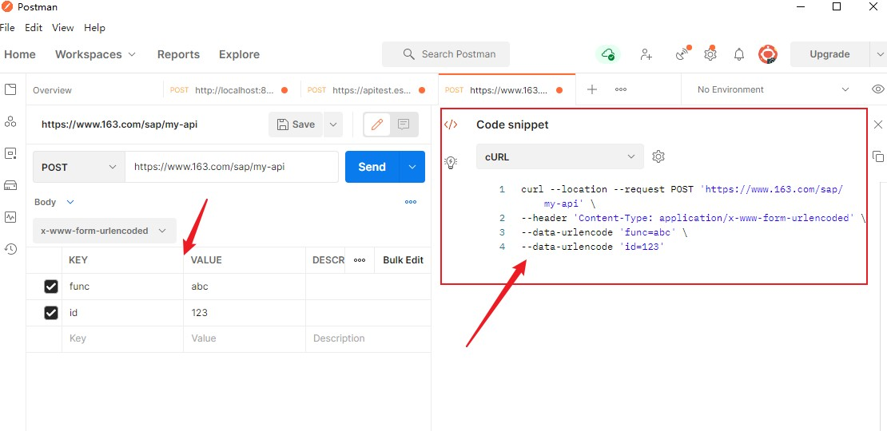

---
# 这是文章的标题
title: 熟悉使用curl调试api
# 这是页面的图标
icon: page
# 这是侧边栏的顺序
order: 6
# 设置作者
# 设置写作时间
date: 2023-02-22
# 一个页面可以有多个分类
category:
  - Web编程
  - DevOps
# 一个页面可以有多个标签
tag:
  - Web编程
  - http基础
  - curl
# 此页面会在文章列表置顶
sticky: true
# 此页面会出现在文章收藏中
star: true
# 你可以自定义页脚
footer: 
# 你可以自定义版权信息
copyright: 无版权
---


## curl介绍

curl，一个很强大的http api调试工具，可以在Shell上直接使用。

::: tip 
作为一个运维，我应该要熟练使用该工具
:::


## 安装

```shell
https://curl.haxx.se/download.html
```

## 常见使用

- 发起GET 请求
```shell
curl -i https://www.163.com
```
- 携带cookies发起请求
```shell
curl -b 'a=1;b=2' https://www.163.com
```

- 保存cookies到文件并使用

```shell
curl -c /tmp/mycookies https://www.163.com
curl -b @/tmp/mycookies https://www.163.com
```

- 携带header发起请求，可以多个-H参数
```shell
curl -H 'Content-Type:application/json' 
-H 'CustomHeader=hello' https://163.com
```

- 发起POST(携带json)
```shell
curl -XPOST -H 'Content-Type:application/json' -d '{"id:1","name:lin"}
```

- 发起POST (携带KV, application/x-www-form-urlencoded)
```shell
curl -d 'k1=value1&k2=value2' https://www.163.com
```

- 携带User-Agent
```shell
curl -A 'Mozilla/5.0 (Windows NT 6.1; WOW64; rv:47.0) Gecko/20100101 Firefox/47.0' https://163.com
```


## 扩展

- 使用POSTMAN可以帮忙生成curl参数
