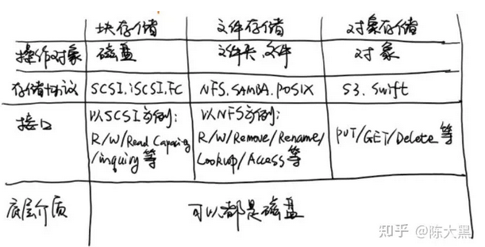
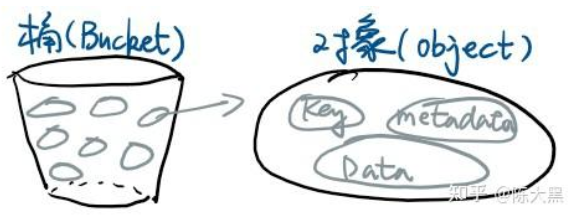
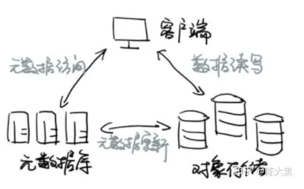

---
# 这是文章的标题
title: 基础架构:存储：对象存储 Object Storage
# 这是页面的图标
icon: page
# 这是侧边栏的顺序
order: 69
# 设置作者
# 设置写作时间
date: 2023-10-31
# 一个页面可以有多个分类
category:
  - 存储
  - 原创
  - 基础架构
# 一个页面可以有多个标签
tag:
  - 对象存储
  - 分布式文件系统
  - 私有云
  - minio
  - Infrastructure
  - 大数据

# 此页面会在文章列表置顶
sticky: false
# 此页面会出现在文章收藏中
star: true
# 你可以自定义页脚
footer: 
# 你可以自定义版权信息
copyright: 无版权
---

## 前言

学习和了解对象存储。主要是了解对象存储的基础知识，以及使用场景。

## 正文

### 什么是对象存储

> 对象存储，`Object Storage`，也叫做基于对象的存储。对象包含数据，但是和文件不同的是，对象在一个层结构中不会再有层级结构。每个对象都被分配一个唯一的标识符，允许一个服务器或者最终用户来检索对象，而不必知道数据的物理地址。

以上来自百度百科，感觉就是一个键值对存储，键是唯一标识符，值就是对象（文件）。

> 因为是分布式部署，又称分布式文件系统

### 对象存储 VS 文件存储 VS 块存储

**结构**
- 对象存储里没有层级结构，是扁平的；传统存储有；

**访问协议**
- 对象存储是基于HTTP RESTFul API进行访问，POST，GET ，PUT和 DELETE操作；
- 传统文件存储通过NFS/CIFS等协议；
- 块存储时通过FC、iSCSI、SCSI；

**操作对象**

 对象存储的操作对象是对象，传统文件存储是文件夹文件，块存储级别（所以称块存储）

 ### 对象存储特点

  - 容量无限大：因为有很好的扩展性，所以可以到 EB 级，多少数据都能存的下
  - 持久可靠：11个 9 甚至以上的可靠性，数据丢失的概率比中五百万的概率还要低 2-3 个量级
  - 低成本：1 部高清电影存 1 年，差不多也就几块钱人民币
  - 使用方便：支持 REST 接口，主要操作为 PUT/GET/DELETE等，使用非常简单。

  ### 应用场景

根据以上特点，可以了解到：

  - 一般用于海量数据的存储。特别适合那些`WORM`应用程序 （**W**rite **O**nce **R**ead **M**any)，
  - 主要是非结构化数据，比如日志、音频、视频、数据备份等冷数据。
  - 写入后的数据一般不更新。

  ### 对象存储的关键概念

  - 桶
  - 对象

桶是对象的逻辑物理存储单元，对象放在桶里，如下：

  

 ### 对象存储的架构

 - 客户端访问对象存储的元数据，获取到唯一标识符(key)；
 - 拿着标识符定位对象的位置(value)；
 

 ### 对象存储的实现方案

 **公有云**

 - Amazon公有云的`Simple Storage Server`，简称S3
 - 阿里云的`Object Storage Service`，简称OSS
 - 其他

**私有云**

企业私有部署可以选择比较热门的免费开源解决方案，比如：

- [Minio](https://min.io/docs/minio/kubernetes/upstream/administration/minio-console.html),社区版（S3兼容）
- [FastDFS](https://baidu.com)

### minio S3

`minio`, 是兼容S3的一款产品，社区支持资源比较丰富以及很丰富的SDK API接口。

**部署**

可以参考：官方社区 [wiki](https://min.io/docs/minio/kubernetes/upstream/administration/minio-console.html)

**使用**

-  [使用mini client for Java操作minio](https://zhuanlan.zhihu.com/p/654273720)

- [如何实现ElasticSearch，OpenSearch使用minio S3作索引快照存储](https://opensearch.org/docs/1.0/opensearch/snapshot-restore/#register-repository)

- [数据备份Veeam使用minio S3作为备份存储Veeam Replication with minio S3](https://min.io/docs/minio/linux/integrations/using-minio-with-veeam.html)

- [Veeam: How-to Deploy, and Configure MinIO with Erasure Coding Enabled, Immutability, and Let’s Encrypt](https://jorgedelacruz.uk/2020/07/22/veeam-how-to-deploy-and-configure-minio-with-erasure-coding-enabled-immutability-and-lets-encrypt/)

### 讨论：如何选择非结构数据存储？是对象存储还是NAS

对象存储拥有有更好的扩展性，但性能较差，IO开销较高，对频繁改动不是很友好（需要整个对象下载一份，再修改上传），因此比较适合：

- **存储不经常修改的冷数据**，例如数据归档备份，图片、音频、视频、ISO镜像等静态资源，适合做二级存储；
- 对IO性能延迟不敏感的应用，例如企业网盘上传和下载；

NAS等传统文件、块存储扩展性一般且成本高，性能较好，对经常需要改动的场景比较合适，因此NAS适合：

- **存储经常改动的热数据**，例如员工Office文档等；
- 不支持RESTful的应用；
- 对IO延迟敏感的应用；

### 扩展：挂载对象存储

> 一些项目实现把S3对象存储挂载到文件系统，前端可以想操作文件系统一样。这种项目有`s3fs`、`juiceFS`。

- `s3fs`, 可以实现把S3存储挂载到文件系统。项目地址：[s3fs](https://github.com/s3fs-fuse/s3fs-fuse)。

- `juicefs`，项目地址：[juiceFS](https://github.com/juicedata/juicefs)

原理是在对象存储前增加了一层，实现了POSIX接口。
不确定稳定性，也没有在网上看到用于生产环境的案例。Reddit上的意见是一个字评价`don't`,2个字`do not`,`don't do it`, `don't do it ever`。如果是普通使用或是非关键应用，可以试试看。