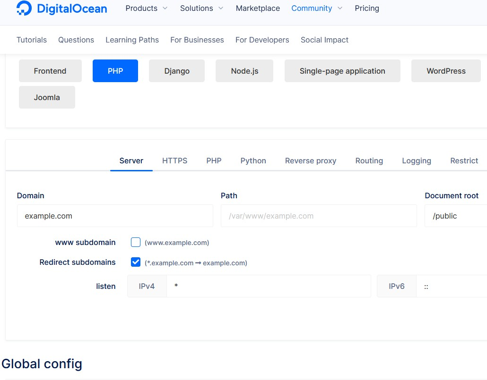

---
# 这是文章的标题
title: 工具：可视化自动生成Nginx配置
# 这是页面的图标
icon: page
# 这是侧边栏的顺序
order: 14
# 设置作者
# 设置写作时间
date: 2023-03-23
# 一个页面可以有多个分类
category:
  - DevOps
  - 工具
# 一个页面可以有多个标签
tag:
  - DevOps
  - Nginx
  - 工具

# 此页面会在文章列表置顶
sticky: false
# 此页面会出现在文章收藏中
star: true
# 你可以自定义页脚
footer: 
# 你可以自定义版权信息
copyright: 无版权
---

:::note
无意中发现一个Nginx工具，`NGINX CONFIG` 可以可视化生成Nginx配置。
:::

## 介绍

Nginx功能强大的Web服务器软件和反向代理。它的配置参数很多，手动配置有时不能一一想到。

DigitalOcean, 著名的主机服务商提供了一个可视化生成NGINX配置的工具。

>The only tool you'll ever need to configure your NGINX server. 

（顺便说一下DO，他们家的很多基础建站教程无论从排版/内容的都很赞）

## 使用方法

- 可以在线使用 https://www.digitalocean.com/community/tools/nginx 
- 也可以`git clone`下来放到本地. Github项目地址 https://github.com/digitalocean/nginxconfig.io

### 截图

