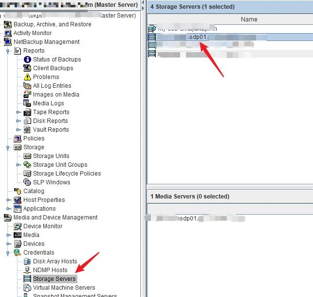

---
# 这是文章的标题
title: 数据保护：Netbackup：使用Automatic Image Replication (AIR)
# 这是页面的图标
icon: page
# 这是侧边栏的顺序
order: 34
# 设置作者
# 设置写作时间
date: 2023-06-19
# 一个页面可以有多个分类
category:
  - 数据保护

# 一个页面可以有多个标签
tag:
  - 数据备份
  - 操作指南
  - Netbackup
  


# 此页面会在文章列表置顶
sticky: false
# 此页面会出现在文章收藏中
star: true

---

## 前言

这几天因为要做NBU还原数据库，但备份在另一个Netbackup服务器（即其他备份域），依稀记得使用AIR可以跨域取备份，但不知道怎么具体操作，于是又把Netbackup学习了一遍，主要是备份复制方面。最后明白其实不使用AIR也可以取备份，后面再说。

## Netbackup复制 (Replication)介绍

- 用于实现不同备份域之间备份数据复制，实现多站点多个备份副本，保证备份高可用性；
- 备份副本可以在本地恢复，也可以在远程域恢复。

:::tip
如果是相同备份域，要使用Duplicate功能
:::


### Automatic Image Replication (AIR) 自动复制

> AIR功能（Automatic Image Replicate）用于实现不同备份域之间的备份数据自动复制。接合SLP (Storage Lifecycle Policy) 实现备份镜像（备份片）自动复制。


### 手动复制
有自动复制，也就有手动复制。手动复制是使用`bpreplicate`命令来手动发起实现跨域手动复制备份片。


### AIR VS 手动复制

- AIR是自动复制，，可以和备份策略一起计划安排;

- 手动复制。可以复制已有备份image，管理员可以手动发起。

**相同**

个人理解，

- AIR就是使用`bpreplicate`相同的API来复制，作为SLP的动作一部分，可以和备份策略一起计划调度。
- 它们都/只可以复制经过SLP备份的数据。非SLP备份的数据不能复制到其他域。

**不同**

主要是使用场景不同：
- AIR不会复制已经复制的备份数据手动复制，需要和备份策略调度使用；
- `bpreplicate`不需要调度，可以在源域和目标域来回复制，任意时间复制。


## 一. AIR复制

### AIR配置要求

- Netbackup 7.5以上版本
- 要求Storage Server存储类型是PureDisk (MSDP重删池，高级选项需要license)
- 只支持PureDisk到PureDisk复制，不支持磁带或是Advanced Disk
- 另外NBU服务器之间不能又NAT （未证实）

### 实现目的

在源域实现数据备份，并同时复制一份备份数据到目标域。在目标域可以实现数据还原。

### AIR配置步骤

- 在源域创建Disk Storage Server，类型`Media Server Deduplication Pool`,步骤略
- 在目标域创建Disk Storage Server，类型`Media Server Deduplication Pool`,步骤略
- 在源域和目标域Master添相互添加对方域为`Trusted Master`，如下图：
如果有证书警告，选择“接受”。

- 在源域的Storage Server上添加目标域Storage Server作为复制对象；
- -  选择目标域的master服务器，选择目标域的Storage server
- -  输入对方存储服务器root命令密码



:::tip 可能异常
在添加目标storage server可能会出现证书不信任异常，例如hand shaking，可以参照文章 ["Netbackup: 如何解决Netbackup CA证书异常问题"](http://www.163.com)，然后再继续。
:::

- 在源域上创建SLP策略。
- - 新建策略。策略名例如 `slp_repl_01`。记下，等下会用到。
- - 指定数据分类"Data Classification"为**None**。选择其他一般会出错
- - 添加策略步骤1，选择"backup"动作，存储选择msdp disk pool
- - 添加策略步骤2，选择"replicate", 选择目标storage的msdp puredisk.

- 在源域上创建备份策略。策略内容：
- - 指定策略存储,Policy Storage为前面创建SLP策略。如下图：


:::tip 步骤提示
如果Policy Storage下拉列表中没有出现之前步骤创建的SLP策略，一般是Data Classification不匹配，重新选择。
:::

- 在目标域上创建SLP策略。策略内容:
- - 策略名必须和源域创建的SLP一模一样。否则不工作；
- - 添加一条import动作。

- 步骤至此完。

### 其他AIR事项

**AIR复制计划**

不可以计划，一般是备份动作发生后的20分钟后；

**如何查看任务状态**


- 可以通过观察job任务详情。在源域的可以看到replicate job在跑，在目标域可以看到`import` job在跑。

**如何管理AIR job**

- 在源域查看未完成的
```
/usr/openv/netbackup/bin/admincmd/nbstlutil list -copy_type replica -U -copy_incomplete
```

- 在源域查看所有已完成的复制
```
# nbstlutil repllist
```
- 在源域上取消一个air job 

```
/usr/openv/netbackup/bin/admincmd/nbstlutil cancel -backupid <xxx_1686896917>
```

- 在目标域上查看import job

```
/usr/openv/netbackup/bin/admincmd/nbstluti pendimplist -U
```

## 二、 手动复制

### 手动复制的使用场景

手动复制可以实现：

- 管理员手动发起复制，在备份域之间手动复制SLP备份数据。

例如，某公司有这样一个备份环境：

- 备份策略：为保证备份可用性，规定备份需要有多个副本；
- 备份架构是：一个是生产环境备份master用来存放备份主副本, 一个是DR Netbackup用来存放备份第二个副本。
- 保留策略：生产备份服务器备份副本保留1周，源程DR站点的Netbackup保留备份1个月。
- 备份计划：生产备份副本定期使用SLP和`AIR`复制一份到DR；这样2个站点都有备份副本；

这样， 一般情况下没有使用手动复制，但如果哪天生产副本过期不可用了，DR副本还在保留期，这时就可以使用`bpreplicate`从DR复制回来到生产域来恢复。


### 如何使用nbreplicate手动复制

- 在目标域创建SLP并由import策略动作；
- 源域Master上执行
```
nbreplicate -backupid XXX_235729 -slp_name <slp_name>
```


## 三、关于复制未通过SLP备份的数据到远程域

### 可选方法1


- 在源域，通过admin console把备份副本duplicate到一个可移动磁盘或介质；
- 把介质拿到或传输到远程站点；
- 把介质挂载到远程站点的媒体服务器media server上；
- 在远程域里的catalog中导入(import)这些备份副本，通过`initiate import`；
详细步骤参考：[How to import NetBackup backup images via the NetBackup Administration Console GUI](https://www.veritas.com/support/en_US/article.100017201)


## 参考

https://annurkarthik.wordpress.com/2016/03/09/command-to-start-manual-replication-of-images-to-remote-netbackup-domain/

https://vox.veritas.com/t5/NetBackup/how-to-replicate-backup-image-from-one-NBU-domain-to-the-other/td-p/894871

