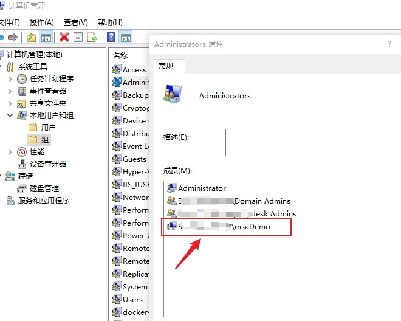

---
# 这是文章的标题
title: Windows：特殊账户管理：了解服务账户、虚拟账户和可管理服务账户
# 这是页面的图标
icon: page
# 这是侧边栏的顺序
order: 43
# 设置作者
# 设置写作时间
date: 2023-06-27
# 一个页面可以有多个分类
category:
  - Windows
  - 系统管理

# 一个页面可以有多个标签
tag:
  - SQLServer
  - Windows
  - 服务账户
  - 服务账户管理


  


# 此页面会在文章列表置顶
sticky: false
# 此页面会出现在文章收藏中
star: true

---

:::tip 背景
在此之前，被一面试官问到，“你们是如何管理服务账户的？”，当时没做细想，直接回答“都是管理员手动管理”, 然后就没有了然后...
:::

当时作此回答，一是基于现实情况，当时我工作的公司接合实际情况选择手动管理。二是，当时虽然可以Get到面试官想考察Windows服务账户托管知识点，但了解比较粗解，没有能力展开说。本文算是一个补充学习，深入了解Windows如何更好地管理服务账户，特别是服务账户的密码管理。


# 了解服务账户

### 服务账户特点

个人理解，广义上说，服务账户(Service Account)是服务运行凭据，也是服务进程访问系统资源，网络资源等资源的凭据。一般有这些特点：

- 使用范围都是特定的，专用于某个服务，不共享使用；
- 不常更新密码 （保证服务稳定）
- 权限都比较低 （最小权限原则，降低安全风险）；

### 服务账户使用范围

- 使用于Windows服务，即通过Service管理单元管理。
- 使用于非Windows平台上的服务，用来访问Windows系统系统、网络资源。例如Linux下访问Windows共享或是Active Directory资源。

### Windows服务账户的管理方式

- 管理员手动管理
- 系统托管管理

**1、手动管理**

> 这是传统的管理方法，不展开说。

好处：适用范围更广，支持各种服务账户运行场景，例如，Windows原生服务不用说，也适用于Linux平台、网络设备上。

不足：管理麻烦。管理手动创建服务账户、管理密码、指定服务账户的权限等，给管理员带来更多管理负担。另外，密码安全隐患大，因为一般情况下，为保证服务稳定，管理员在没有安全审计强制要求下，不会更新服务账户密码。

**2、系统托管管理**


好处：更少的管理任务，密码自动更新，安全性更强。

不足: 适用范围小，仅支持Windows服务；不适用其他平台下的服务。


### 如何选择管理方式

接合实际情况，可以自由选择。

- 如果是纯Windows环境，使用手动管理，也可以完全由系统托管。
- 如果环境有Windows，也有网络设备等非Windows需要使用服务账户，也可以组合使用。


# 托管Windows服务账户

> 以上了解到Windows服务账户可以交由系统托管，最大的特性是不用管理密码，减少管理任务，提高安全性，但也需要注意局限性，例如不适用非Windows平台。

## 托管Windows服务账户类型


- 普通可管理服务账户(Standalone Managed Service Account, MSA)
- 组可管理服务账户（ Group-Managed Service Account, gMSA)
- 虚拟账户 （Virtual Account or Local Managed Account)


## 一、普通可管理服务账户 (MSA)

> 普通可管理服务账户是一种特殊的域计算机账户，就像域计算机账户一样，继承同一个AD对象类。所以就会像计算机账户一样有能力每隔30天自动更新密码。

> MSA有一些局限性。

- 只能绑定给一台计算机上的服务使用，因此不能用于一些服务集群场景。
- 不能用于多台计算机。否则服务启动失败。
- 已经被接下来的gMSA取代。

### 使用MSA

MSA被gMSA取代，使用方法大致可参照以下gMSA，不展开写。具体参考：

[Managed Service Accounts: Understanding, Implementing, Best Practices, and Troubleshooting](https://techcommunity.microsoft.com/t5/ask-the-directory-services-team/managed-service-accounts-understanding-implementing-best/ba-p/397009)

## 二、组可管理服务账户 (gMSA)

> gMSA是MSA的增强服务账户类型，旨在取代MSA，本文重点。

相比普通MSA, gMSA在拥有相同功能情况下，还扩展了更多特性，gMSA可以绑定到更多计算机上，支持多主机网络均衡负载等复杂服务和其他使用场景,目前已知支持的服务有：

- SQL Server
- IIS
- AD LDS
- Exchange Server
- Windows计划任务

:::warning 不支持的场景和服务
gMSA不支持用于Windows集群服务，但支持应用到集群之上的服务。其他服务则需要和软件服务商确认。
:::

### 前提要求

- 操作系统最好是Windows Server 2012或更高；
- 域环境，域架构级别是Windows Server 2012以上；
- 64位系统；


### 使用gMSA

> 开始之前要先创建一个Kds Root Key,详见 [Get Started with Group-Managed Server Account](https://learn.microsoft.com/en-us/previous-versions/windows/it-pro/windows-server-2012-R2-and-2012/jj128431(v=ws.11)?redirectedfrom=MSDN)

- 创建Kds Root Key。在Windows Server 2012或更高的域控制器上执行:
```powershell
Add-KdsRootKey –EffectiveImmediately
```
并等待10个小时的AD复制。另外可使用 `Test-KdsRootKey -KeyId (Get-KdsRootKey).KeyId`查看创建结果。

- 10小时后，创建一个AD安全组，例如Svc_Account_Computers。这个安全组成员将包含所有将要使用这个gMSA的计算机。

- 创建gMSA账户,例如svc_SQLserver并绑定给安全组Svc_Account_Computers。
```powershell
New-ADServiceAccount -name svc_SQLserver  -PrincipalsAllowedToRetrieveManagedPassword Svc_Account_Computers 
```

> 创建gMSA需要Domain Admin成员。另外默认情况下，gMSA账户创建在CN=Managed Service Accounts，可以在`AD计算机和账户`下的 `Managed Service Account` 中查看到。


- 部署安装MSA账户到目标主机。使用域管理员身份账户登录到所有需要使用gMSA主机(是那个安全组成员)，然后执行：


``` Powershell
Install-ADServiceAccount -Identity svc_SQLserver
```

> 主机需要安装和加载Active Directory Module for Powershell。并可以使用`Test-ADServiceAcount -id svc_SQLserver`来查看部署是否成功。

:::tip 安装异常
安装时可能会有异常。提示类似权限不足的错误信息，可以尝试把主机重新启动一下后再尝试。
:::

- 最后，把gMSA账户指定给目标服务

在服务属性里，输入gMSA账户名，账户名格式 `<domainName>\<服务账户名>$ `,例如
`mydomain\myMSA$`，密码一定留空。


> 另外，也可以把MSA账户用到Windows计划任务。

- 重启服务。如果无问题，服务正常启动。


### 关于gMSA服务账户的授权

默认gMSA都是`Domain Computers`安全组成员，权限都不高。如果需要增加权限，可以直接把gMSA账户加入到指定的域安全组或本地安全组即可。如下图，添加到目标主机的本地管理员组：




> 另外，前面提到gMSA服务账户已可以使用到Windows计划任务中，这时也要给gMSA授权，授予`Log on as a batch job` 允许批处理权限，具体方法是在本地组策略用户权限指派中完成。当然，也可以简单点，直接把gMSA添加到Local Administrators组中。

## 三、虚拟账户 Virtual Account

> 虚拟服务账户，又称Local Managed Account，这里仅作了解。

### 了解虚拟账户特点

- 它们是本地系统账户，不是域账户。账户名格式 NT SERVICE\<SERVICENAME>.
- 它们可以访问域环境资源，是通过域计算机账户身份访问网络资源的, 例如MyDomain\mycomputer$
- 不需要管理密码；


### 虚拟账户的创建

一般都是由Windows应用程序安装时创建生成的，不需要管理员创建。例如安装SQL Server后，服务器上有：

- NT SERVICE\MSSQLSERVER  （数据库引擎服务使用）
- NT Service\SQLSERVERAGENT （SQL Agent服务使用）

### 虚拟服务账户的权限分配

一般情况下，服务默认使用虚拟服务账户凭据运行，本着最小权限运行服务的最佳实践。但有时需要访问一些本地特殊系统资源，则可以额外授权。或是改用其他服务账户类型，即以上的MSA或gMSA。


### 虚拟服务账户的授权

本地资源授权时，授权目标是虚拟服务账户名，网络资源授权时，授权目标是虚拟账户所在的计算机账户，例如MyDomain\mySQLServerHost$

:::tip
虚拟账户在本地计算机账户管理中看不到的，在授权时可以直接输入账户名。
:::

## 参考文章

[Using Managed Service Accounts (MSA and gMSA) in Active Directory
](https://woshub.com/group-managed-service-accounts-in-windows-server-2012/)


[Getting Started with Group Managed Service Accounts](
https://learn.microsoft.com/en-us/previous-versions/windows/it-pro/windows-server-2012-R2-and-2012/jj128431(v=ws.11)?redirectedfrom=MSDN)