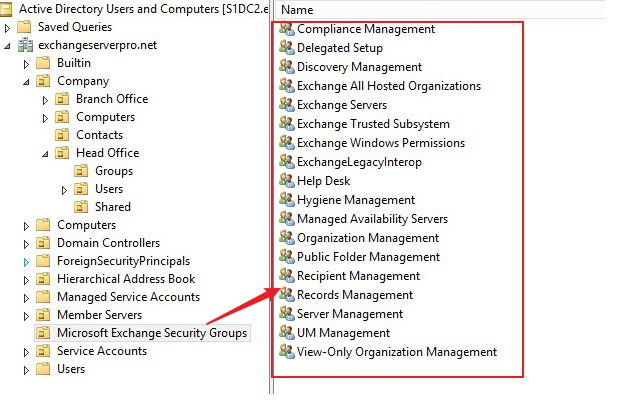
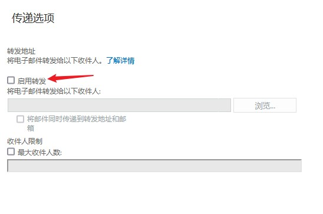
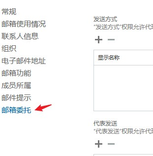
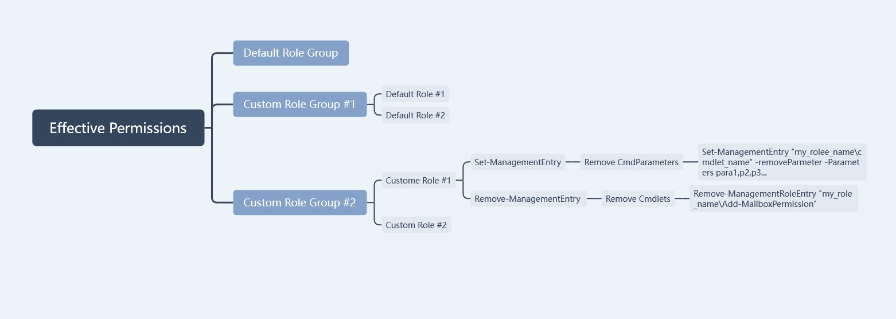

---
# 这是文章的标题
title: Exchange Server系列：RBAC 介绍Exchange Server管理角色
# 这是页面的图标
icon: page
# 这是侧边栏的顺序
order: 53
# 设置作者
# 设置写作时间
date: 2023-08-29
# 一个页面可以有多个分类
category:
  - Windows
  - Exchange Server
  - Messaging
# 一个页面可以有多个标签
tag:

  - 邮件系统
  - ExchangeServer
  - 权限控制
  - RBAC

# 此页面会在文章列表置顶
sticky: false
# 此页面会出现在文章收藏中
star: true

---


## 前言

基于角色`Role Based Access Control` 介绍Exchange Server的管理权限，满足ISO 270001 `A9.2.3 特殊权限管理`或是其他安全体系的类似要求，做到不同岗位不同权限。

## 一、Exchange Server权限介绍

### 管理权限组成

分层管理和权限模型是：

- 管理角色组 (Role Group)
- 角色  (Role)
- 管理权限条目 (Role Entry)


### 管理角色组 (Role Group)

管理角色组,是由一组角色组成，即一对多关系，一个角色组可以拥有多个角色。

- 默认角色组

Exchange常用有：

- Organization Mangement （Exchange组织管理员，权限很高)
- Recipient Management (Exchange用户邮箱管理员)

更多的可以在Active Directory的ADUC的`Microsoft Exchange Security Groups`看到.


- 可以通过看到角色组对应了哪些角色
```
PS C:\> Get-RoleGroup "recipient management" | select -expand roles
Distribution Groups
Migration
Mail Recipients
Team Mailboxes
Move Mailboxes
Mail Recipient Creation
Recipient Policies
Message Tracking
```

- 定义角色组

可以自定义角色组。步骤文章后面【授权】章节介绍。


### 角色 （Role)

> Role是Role Group的子集。

**默认Role**

默认有很多，分得比较细，不同role执行不同管理任务：

```
PS C:\> get-managementrole | select name| sort -Property name

Name
----
Active Directory Permissions
Address Lists
ApplicationImpersonation
ArchiveApplication
Audit Logs
Cmdlet Extension Agents
...
Role Management
...
User Options
UserApplication
View-Only Audit Logs
View-Only Configuration
View-Only Recipients
WorkloadManagement
```
其中，常用的角色是：
- `Mail Recipients` 邮箱管理
- `Distribution Group` 邮件通讯组管理
- `User Options` 高级邮箱选项管理

**自定义Role**

除了默认Role, 我们还可以自定义role, 后面【授权】章节介绍。

**查看Role都能干些什么**

- 查看指定Role都有哪些Role Entry (即有权做什么)。例如查看角色`Mail Recipients`对应的entry:
```
PS C:\> Get-ManagementRole  "mail recipients" | select -expand RoleEntries |select-string "new-mailbox"

(Microsoft.Exchange.Management.PowerShell.E2010) New-Mailbox -EnableRoomMailboxAccount
(Microsoft.Exchange.Management.PowerShell.E2010) New-MailboxRepairRequest -Archive -Confirm -CorruptionType -Database -Debug -DetectOnly -DomainController -ErrorAction -ErrorVariable -Force
 -Mailbox -OutBuffer -OutVariable -StoreMailbox -Verbose -WarningAction -WarningVariable -WhatIf

```


### Role Entry

> `Role Entry`  是role的子集，由`Exchange cmdlet`和`Exchange cmdParameter`组成, 例如`Exchange cmdlet`常用的,新建邮箱`New-mailbox`、设置邮箱`Set-mailbox`

:::note
由上可以看出Exchange RBAC就是通过控制使用cmdlet和Parameter来管理权限，我们可以通过给Role指定分配不同的entry来自定义role, 最终决定哪些角色可以执行哪些cmdlet。
:::

:::tip
另外，可以通过cmdlet来倒查哪些角色拥有的权限。例如，想查询哪些角色有新建邮箱的权限。
```
PS C:\> Get-ManagementRole  -cmdlet "new-mailbox"

Name                        RoleType
----                        --------
Mail Recipient Creation     MailRecipientCreation
Mail Enabled Public Folders MailEnabledPublicFolders
Public Folders              PublicFolders
Retention Management        RetentionManagement
Mail Recipients             MailRecipients
```
:::


## 二、授权

- 方法1：使用默认角色组和自定义角色组授权。
- 方法2：使用自定义角色授权；


以上管理授权颗粒由粗到细。

### 使用角色组

一般情况下，使用角色组授权就可以满足基于RBAC的管理需求。常用的是：

- `Organization Management` 成员是Exchange管理员，管理组织所有设置/策略；
- `Recipient Management`的成员是桌面运维支持人员，可以创建邮箱和设置邮箱选项等；

如果不能满足，则自定义角色组。下面举例说明：

**需求**

例如，如果新建一个自定义管理角色组只允许创建邮箱，不允许管理通讯组。则可以新建一个角色组，可以考虑只给予`Mail Recipient Creation`角色，不给予`Distribution Groups`角色。


**开始**

1、登录EAC,点击【新建】或是通过【复制】，然后编辑复制出然后编辑角色；

2、 添加给新建的角色Mail Recipient Creation；不添加其他角色；

3、 如果是复制的角色组，则移除Mail Recipient Creation外的所有其他权限；

4、 添加成员；

**小结**

通过自定义角色组，可以满足一般的授权需求。如果需要更加精细的控制颗粒，例如不允许角色设置某个邮箱属性，则需要通过自定义角色，可以参照以下【使用自定义角色】。


### 使用自定义角色

> 通过前面介绍，我们知道可以通过给Role指定分配不同的entry来自定义role, 最终决定哪些角色可以执行哪些cmdlet，这样就可以定义更细致的授权颗粒，下面通过举例说明。

:::note
自定义角色必须通过Exchange Management Shell，Exchange Admin Console不支持。
:::


**需求**

需要一个邮箱管理员角色，改角色可以新建邮箱但不可以设置用户邮箱的【邮件转发】、【邮箱委托】。如下图：





**需求分析**

了解到`邮件转发`、`邮箱委托`对应的cmdlet和cmdParameter. 了解到：
- 邮件转发对应的cmdlet是`Set-Mailbox` ,对应的parameters有 cmdParameters `ForwardingAddress`,`ForwardingSmtpAddress`,`DeliverToMailboxAndForward` 

- 邮箱委托对应的cmdlet是`Add-mailboxPermission`
- 新建一个角色，不给这个角色这几个cmdlet和parameter的执行权限就可以实现。


**开始**


```
## 先新建一个自定义角色 My Mailbox Admins。这角色必须以已有角色为模板，本例中使用Mail Recipients为模板。
PS C:\> New-ManagementRole -Parent "Mail Recipients" -Name "My Mailbox Admins" 

## 编辑自定义角色。通过编辑Role Entry，编辑cmdlet或cmdParameter来达到编辑目的. 

# 例1：删掉set-mailbox 这个cmdlet的部分cmdParameters来降低权限，在本例中移除几个相关cmdParameters来删除邮件转发设置权限。
PS C:\> Set-ManagementRoleEntry "My Mailbox Admins\Set-mailbox"  -RemoveParameter -Parameters GrantSendOnBehalfTo,ForwardingAddress,ForwardingSmtpAddress,DeliverToMailboxAndForwardPS 

#例2：禁止该角色授权邮箱权限给其他用户，通过删除整个Add-mailboxPermission cmdlet.
PS C:\> Remove-ManagementRoleEntry "My Mailbox Admins\Add-MailboxPermission" 
```

:::tip 
(2023/11/10更新）不能添加父角色没有的cmdlet和cmdParameters给角色，否则会收到以下类似异常。例如，当我尝试`Set-ManagementRoleEntry "My Mailbox Admins\new-mailbox" -AddParameter -Parameters Room,RoomMailboxPassword`。由于"(Microsoft.Exchange.Management.PowerShell.E2010) New-Mailbox -EnableRoomMailboxAccount -Room -RoomMailboxPassword"管理角色条目的父角色不包含相同角色条目的以下参数，无法将条目添加到"my Mailbox Admins"管理角色:"Room,RoomMailboxPassword"。
:::


**效果**

- 改角色的成员登录EAC后，邮件流 - 邮件转发复选框是灰色的，不可以勾选。
- 邮箱委托添加成员后不可保存设置。

**小结**

通过以上，可以比较精细控制Exchange管理权限。过程比较花时间的就是找出需要控制的cmdlet和parameters，只能多查询得到。

### 授权流程

>通过以下图示一览授权流程。



## 三、总结

1. 授权颗粒从大到小分别是：

默认角色组> 自定义角色组 > 自定义角色

2. 授权原则

- 一般授权使用默认角色组；
- 更细一点选择使用自定义角色组 + 默认角色
- 最细一点选择使用自定角色组 + 自定义角色

根据控制需求选择适合的授权模式。