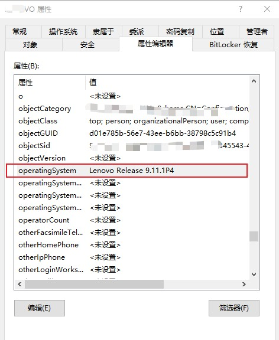
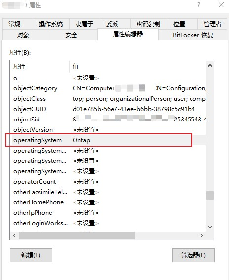

---
# 这是文章的标题
title: 工具介绍系列：安全审计 ManageEngine ADAuditPlus
# 这是页面的图标
icon: page
# 这是侧边栏的顺序
order: 55
# 设置作者
# 设置写作时间
date: 2023-09-06
# 一个页面可以有多个分类
category:
  - Windows
  - Security
  - Auditing
# 一个页面可以有多个标签
tag:

  - 文件审计
  - 权限控制
  - 活动目录


# 此页面会在文章列表置顶
sticky: false
# 此页面会出现在文章收藏中
star: true

---


## 前言

介绍一款安全审计工具`ManageEngine ADAudit Plus`，

>Tracking file and folder modifications with ADAudit Plus


主要支持：

- 活动目录审计
- 文件系统审计。

## 一、活动目录审计

审计项目：

- AD用户对象变更，例如：（用户账户/计算机账户创建、删除、登录活动异常分析、账户锁定等）
- AD组对象变更。例如成员变更等；
- 组策略对象的变更等


## 二、文件系统审计

审计对象：

- 文件和文件夹的变更。例如添加/删除/移动/修改等；

支持：
- Windows文件服务器
- NetApp Ontap (Cluster)
- 联想凌拓Lenovo Release (需要特殊配置)

## 安装和配置

简单不介绍，安装后，几乎是开箱即用。

## 文件系统审计和联想凌拓NAS集成

之所以单独讲联想凌拓NAS，是因为如果不做特殊配置，ADAudit Plus无法做文件审计联想凌拓NAS文件活动。


**具体问题**

凌拓NAS虽然运行的系统也是ONTAP，但还是有些不同。例如：VServer(SVM)加入活动目录后，会在目录中创建一个AD计算机对象。但ADAudit Plus无法在AD活动目录中发现搜索这个SVM，你通过ADAudit配置NetApp服务器向导会看到：

> " No Active Directory Objects available."

意思是NAS SVM没有发现，这样向导就没法继续配置发现NAS上的共享了和开启审核。 

- 查看NAS端的审计配置

```
MyFileCluster::> vserver audit show -vserver svm_cifs

                           Vserver: svm_cifs
                    Auditing State: true
              Log Destination Path: /vol_sys_auditing
     Categories of Events to Audit: file-ops, audit-policy-change
                        Log Format: evtx
               Log File Size Limit: 200MB
      Log Rotation Schedule: Month: -
Log Rotation Schedule: Day of Week: -
        Log Rotation Schedule: Day: -
       Log Rotation Schedule: Hour: -
     Log Rotation Schedule: Minute: -
                Rotation Schedules: -
          Log Files Rotation Limit: 5
            Log Retention Duration: 0s
      Strict Guarantee of Auditing: true
```
- 再看看NAS端的SVM CIFS配置，似乎也没有问题。
```
MyFileCluster::> vserver  show -vserver svm_cifs
```


翻遍ManageEngine ADAudit Plus的官方支持手册和Google也没有解决方案。

:::tip 题外：什么是ONTAP VServer/SVM

Storage Virtual Machine（SVM，以前称为 Vserver） ONTAP SVM 对于客户端而言都是一个专用CIFS/NFS服务器，简单理解SVM就是运行在ONTAP里面的一台虚拟机，对外提供CIFS/NFS协议。
:::

** 解决方案和特殊配置**

SVM计算机对象明明已经在AD里面存在了，为什么会搜索不到？

分析，ADAudit应该是通过一些特定AD属性来发现和判断计算机对象是否是NetAPP ONTAP。翻看这个SVM AD计算机属性，分析比较有可能就是AD计算机属性的`operatingSystem`，如下图：




以上图，凌拓默认使用的是`Lenovo Release 9.11.1P4`, 尝试修改成`Ontap`,如下图：



等待几分钟，然后通过ADAudit配置NetApp服务器向导，可以发现到了! :-)

发现后，根据文档配置NAS集群和启动文件审计选项即可。

**一些SVM配置审计参考**

