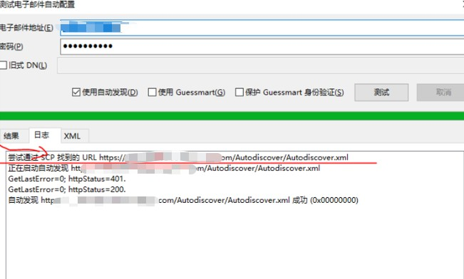

---
# 这是文章的标题
title: Exchange Server系列：自动发现服务
# 这是页面的图标
icon: page
# 这是侧边栏的顺序
order: 57
# 设置作者
# 设置写作时间
date: 2023-09-12
# 一个页面可以有多个分类
category:
  - Windows
  - Exchange Server
  - Messaging
# 一个页面可以有多个标签
tag:

  - 邮件系统
  - ExchangeServer
  - Outlook
  - WebService
  - Autodiscovery

# 此页面会在文章列表置顶
sticky: false
# 此页面会出现在文章收藏中
star: true

---


## 前言

Outlook的Autodiscovery功能可以实现Exchange邮箱自动配置。启动Outlook时根据邮箱地址自动发现企业组织的Exchange服务器和邮箱配置，很方便。

## 自动发现介绍

> Exchange Server/Outlook自动发现服务。发现的方式有这么几种，Outlook会尝试以下方式。尝试顺序根据Outlook版本不同而不同：
> 

### 1. SCP object lookup

Outlook performs an Active Directory query for `Service Connection Point` (SCP) objects.

https://learn.microsoft.com/en-us/windows/win32/ad/publishing-with-service-connection-points?redirectedfrom=MSDN

### 2. Root domain query based on your primary SMTP address

Outlook uses the root domain of your primary SMTP address to try to 
locate the AutoDiscover service. Outlook tries to connect to the 
following URL based on your SMTP address:

`https://<smtp-address-domain>/autodiscover/autodiscover.xml`

### 3、Query for the AutoDiscover domain

Outlook uses the AutoDiscover domain to try to locate the 
AutoDiscover service. Outlook tries to connect to the following URL 
based on your SMTP address:

`https://autodiscover.<smtp-address-domain>/autodiscover/autodiscover.xml`

### 4、HTTP redirect

Outlook uses HTTP redirection if Outlook cannot reach the AutoDiscover service through either of the secure HTTPS URLS:

`https://<smtp-address-domain>/autodiscover/autodiscover.xml`

`https://autodiscover.<smtp-address-domain>/autodiscover/autodiscover.xml`

### 5、SRV record query in DNS

Outlook uses an SRV record lookup in DNS to try to locate the AutoDiscover service.

## 一般情况

- 未加入域的电脑，一般Outlook会先尝试 will try to connect to the predefined URLs (such as `https://autodiscover.contoso.com/autodiscover/autodiscover.xml`) by using DNS
- 加入域的电脑，一般Outlook会先尝试 `SCP` 这个方式。先搜索AD目录中的SCP对象，这个对象返回值是所有组织内部的Exchange CAS服务器URL，然后向第一个发起配置查询。
    - searches for the Autodiscover SCP objects. After the client obtains and enumerates the instances of the Autodiscover service, the client connects to the first Client Access server in the enumerated list and obtains the profile information in the form of XML data that's needed to connect to the user's mailbox and available Exchange features.

## 特殊情况

管理员可以控制Outlook的自动发现方式和行为，详细参考以下

通过修改Oultook所在电脑的注册表中的autodiscover键，可以有选择的关闭自动自动发现行为：

- PreferLocalXML
- PreferProvidedEmailInAutoDiscoverAuthPrompts
- ExcludeHttpRedirect
- ExcludeHttpsAutoDiscoverDomain
- ExcludeHttpsRootDomain
- ExcludeScpLookup
- ExcludeSrvRecord
- ExcludeLastKnownGoodURL (only applies to Outlook 2010 version 14.0.7140.5001 and later versions)
- ExcludeExplicitO365Endpoint (only applies to Outlook 2016 version 16.0.6741.2017 and later versions)


## 扩展： 如何控制Outlook自动发现行为


使用Outlook组策略模板，详细参考：

https://learn.microsoft.com/en-us/outlook/troubleshoot/profiles-and-accounts/how-to-control-autodiscover-via-group-policy

### 查看Outlook当前使用的自动发现方式

- Ctrl + 右键outlook, —>>>测试配置，勾去”使用Guessmart和保护Guessstart身份验证“。
- 点击”测试“
- 查看日志

以下示例，显示Outlook是**通过SCP方式**实现自动发现。



## 测试和检查Exchange服务器的WebService


```shell
PS C:\> Test-OutlookWebServices -Identity test_user -MailboxCredential (Get-Credential) -TrustAnySSLCertificate  -ClientAccessServer cas01.example.com

位于命令管道位置 1 的 cmdlet Get-Credential
请为以下参数提供值:
Credential

Source                              ServiceEndpoint                     Scenario                       Result  Latency
                                                                                                                  (MS)
------                              ---------------                     --------                       ------  -------
cas01.example.com        cas01.example.com       自动发现: Outlook 提供程序     Success      35
cas01.example.com        cas01.example.com       Exchange Web Services          Success      14
cas01.example.com        cas01.example.com       可用性服务                     Success      71
cas01.example.com        cas01.example.com       脱机通讯簿                     Success      17


```