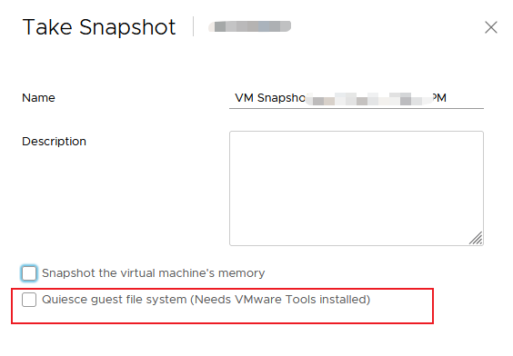

---
# 这是文章的标题
title: 服务器虚拟化系列：VMWare:虚拟机快照
# 这是页面的图标
icon: page
# 这是侧边栏的顺序
order: 64
# 设置作者
# 设置写作时间
date: 2023-10-16
# 一个页面可以有多个分类
category:
  - 虚拟化
  - VMWare

# 一个页面可以有多个标签
tag:
  - VMware
  - 快照
  - 虚拟化
  - Virtualization
  - Snapshot
  - ESXi

# 此页面会在文章列表置顶
sticky: false
# 此页面会出现在文章收藏中
star: true

---

## 前言

通过 [虚拟机系列：虚拟机磁盘文件介绍](https://blog.solex-inc.com/zh/%E4%BF%A1%E6%81%AF%E6%8A%80%E6%9C%AF/SysOps/post65_ops_vmware_01.html) 了解了虚拟机磁盘文件, 这篇是学习虚拟机快照的基础原理，对快照管理提高认识，也是对参考文章的知识点进行highlight。

>系统管理员非常喜欢使用快照，给虚拟机做变更前，习惯先创建一个快照，出了问题回滚到快照前就好了，很方便。
但有时不合理的使用，例如用来取代做数据备份，其实是不可取的。

## 虚拟机快照介绍

虚拟机快照，`Snapshot`。用来存储虚拟机某个时间点的状态、数据，注意时某个时间点的数据和状态，并不是整个虚拟机磁盘的克隆，快照存储的是磁盘的增量内容。

## 虚拟机快照工作机制

### 创建快照

>对一个虚机做快照，相当于将虚机当前的磁盘(即base vmdk，一般是-flat.vmdk)设为只读模式，然后创建 delta vmdk 文件，它将会接受新的数据写操作。

一个delta.vmdk文件代表一个快照(`delta`代表数字序列号)，如果有多个快照就有多个delta.vmdk文件。

最新的快照delta磁盘文件，位于最上方，是唯一的写入层，之前的快照磁盘变为只读

- **写损失**： 

>写的时候，遵循 `Copy-on-write` 机制，按照数据分块，当需要修改某一块中的数据时，先将它从父vmdk 中拷贝到 delta vmdk，然后再对它修改。

- **读损失**

>当读取某一块数据时，ESXi 需要判断从哪里去读：
对于没有修改的数据块，从父 vmdk 读；
对已经修改了的数据块，从 delta vmdk 读。

可见，客户端的一次读操作，可能需要从不同的 vmdk 上读取数据。

>delta vmdk 的大小不会超过 base vmdk 的大小，因为极限情况是所有的数据都被拷贝到delta vmdk 并且都没修改了。，。vSphere 限定一个虚机最多有 32 个快照，但是建议最多只有 2-3 个，而且快照的保留时间不超过一天。

:::note
因为快照会带来读和写损失，因此一个虚机不能有太多的快照,否则会带来虚拟机性能下降。
:::

### 删除快照

删除快照，并不会删除当前的数据。它是怎么做到的呢。其实，快速删除做了以下：

- 快照删除时，先触发快照向下磁盘文件（或父快照）合并数据(Consolidate)。被删除的快照上的数据会合并到它的父快照（或基础磁盘）

- 然后，删除快照磁盘文件。

**数据合并 Consolidation**

- 直接基于基础磁盘(Base VMDK)的快速上的数据，直接向Base VMDK合并，写入base vmdk文件；
- 基于有父快照的快照会向父快照的delta磁盘文件何婷，数据吸入到父快照delta vmdk文件；
- 如果时删除所有快照，所有快照会直接向base vmdk合并，不在一层一层合并；

:::warning

删除快照意味着快照之后的改变会被合并到快照之前的数据，因此虚拟机无法回退到创建快照时的状态！
:::

:::note
删除快照因为会带来数据合并，造成磁盘大量IO写，因此虚拟机的性能受到影响！
:::

### 恢复快照

恢复快照，就是把虚拟机的base vmdk指向到目标快照的vmdk。其结果时从目标快照创建后的一切改动都将丢失。

## 扩展：快照类型

创建快照时，其实有3种快照：

- 崩溃一致快照（Crash-Consistent Snapshot)

- 应用一致性快照 （Application-Consistent Snapshot)

- 文件系统一致快照 （File System Consistent Snapshot)

### 崩溃一致快照

应用程序还在运行，IO还在进行的创建的快照。相当于虚拟机突然断电了磁盘的状态。

**一、特点**

优点：速度快。
缺点：恢复快照可能会丢失数据。创建快照时，因为文件系统/应用程序如果有数据还在内存中或缓存里没有来得及写入磁盘（即还有脏数据），快照指令也不会向应用发送flush立即写入磁盘。 

::: tip 怎么克服缺点
为保证一致性，只有停止IO。例如先正常停止应用程序运行或关闭虚拟机电源，再进行快照创建。
::: 

**三、应用场景**

该类型的快照多用于非关键业务应用，能自动修复机制的文件系统。比较好的文件系统有一致性检查功能，及时文件系统不一致，也可以通过日志自我修复。

**四、创建方法**

通过vSphere Web控制台创建快照时，默认如果没有勾选【静默客户端文件系统】或是虚拟机没有安装VMware Tools，则创建的是该类型快照。

### 应用一致性快照

>又称`文件系统静默快照` (File System Quiseced Snapshot)，就是可以保证客户端操作系统的应用一致性的快照。做快照之前，虚拟机里的应用程序被暂时冻结（Quiseced)，注意：冻结不得超过60秒。内存中的脏数据都被刷进磁盘；在快照做完之后，应用被解冻。此时的快照是应用程序一致的。

**一、特点**

优点：可以保证应用数据的一致性，属于Application-Aware。
缺点：因为需要冻结应用，可能会造成应用不可用。

::: tip 怎么克服缺点
创建快照时，会影响应用的可用性，可以通过计划快照创建到非业务繁忙时间段。
::: 
 

**二、前提条件**

虚拟机上安装对应的VMWare Tools

**三、应用场景**

该类型的快照多用于数据库应用的数据备份。快照创建一般由备份软件发起的。

**四、创建方法**

它的工作过程大致如下：

**Windows**

Windows平台上，VMware Tools需要使用到`Microsoft VSS Provider`,VSS是一个接口，实际还需要`VSS Writers`来实现冻结静默操作，详细如下：

- 备份程序发出 quiesced snapshot 创建请求给 `vCenter`，vCenter 给虚机所在的 ESXi 的 `hostd` 服务发出指令

- ESXi 上的 `Hostd` 将请求传给客户机内的 `VMware Tools`

- VMware tools 以 `VSS Requester` 的身份通知 VSS，VSS 再通知已经注册的文件系统以及各应用的 `VSS writer` 执行各自的数据下刷和冻结操作（应用的暂时冻结不能超过60秒）

- 一旦完成，VMware tools 将就结果告诉 hostd

- `Hostd` 再执行快照操作

- 操作结束，按照前面的顺序再对文件系统和应用进行解冻。

:::note
从以上看出，该类型快照，需要在虚拟机内部安装VMWare Tools以及需要应用程序厂商对应的VSS Writer。微软应用一般都有，比例比较常见的Exchange和MSSQL。通过`vssadmin list providers` 和`vssadmin list writers` 可以查看。
:::

**其他系统**

和Windows系统不同，Linux没有所谓的VSS Writer。这样，静默Linux虚拟机需要管理员自己编写静默脚本配合VMWare Tools来完成。主要是要写一个脚本实现VMware Tools的3个操作。

- 安装VMware Tools(必须)
- 脚本要放在位置` /etc/vmware-tools/backupScripts.d`,脚本可以有多个。每个脚本要实现：

- `freeze`。怎么开始冻结操作；
- `thaw`, 怎么释放冻结；
- `freezFail`,冻结失败怎么处理；

**范例1：support quiescing for PostgreSQL database** 

[Scripts](../../PostAttachements/Post64/postgresql/quiesce_postgre.sh)

**范例2：support quiescing for MySQL database**

- [pre-freeze-script.sh](../../PostAttachements/Post64/mysql/pre-freeze-script.sh)

- [post-thaw-script.sh](../../PostAttachements/Post64/mysql/post-thaw-script.sh)

- [config.sh](../../PostAttachements/Post64/mysql/config.sh)

### 文件系统一致性快照

又称`文件系统静默快照` (File System Quiseced Snapshot)，就是可以保证客户端操作系统的文件系统一致性的快照。同样，做快照之前，虚机的文件系统被暂时冻结（Quiseced)，内存中的脏数据都被刷进磁盘；在快照做完之后，文件系统被解冻。此时的快照是文件系统一致的。

**一、特点**

略
 

**二、前提条件**

虚拟机上安装对应的VMWare Tools

**三、应用场景**

该类型的快照多用于虚拟机的整机备份。

**四、创建方法**

通过vSphere Web控制台创建快照时，勾选【静默客户端文件系统】并确保虚拟机没有安装VMware Tools，则创建的是该类型快照。

## 参考

- [详解云与备份之VMware虚机备份和恢复](https://www.jb51.net/article/108224.htm),作者SammyLiu

- [Enabling Quiescing for Linux VMs](https://docs.vmware.com/en/VMware-Cloud-Disaster-Recovery/services/vmware-cloud-disaster-recovery/GUID-DBF1DFD5-F956-4ED9-AF06-95664D3AA89D.html)

