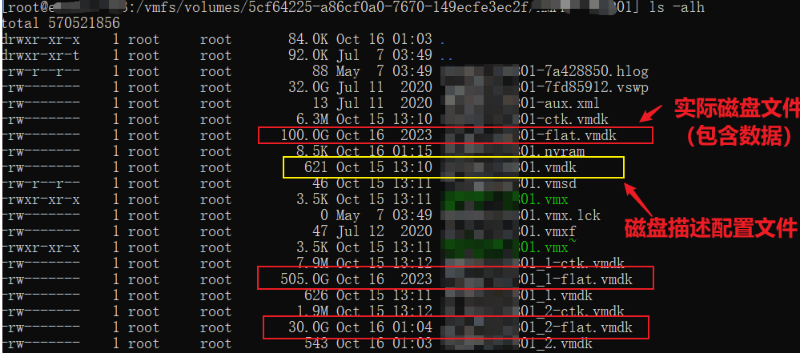
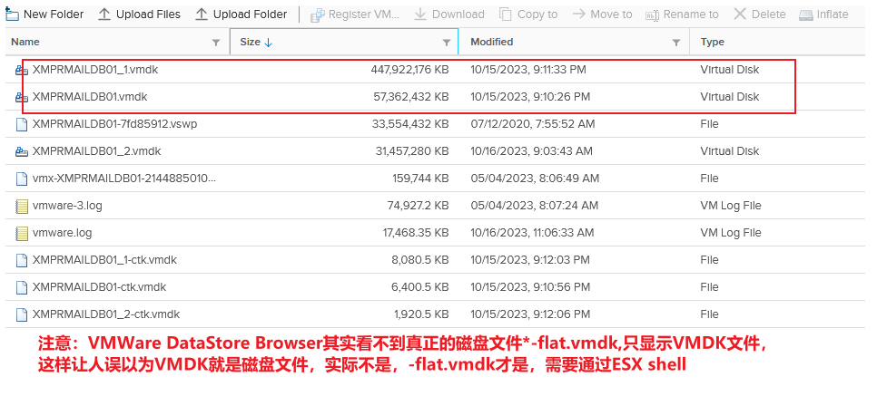

---
# 这是文章的标题
title: 服务器虚拟化系列：VMWare:虚拟机磁盘文件
# 这是页面的图标
icon: page
# 这是侧边栏的顺序
order: 65
# 设置作者
# 设置写作时间
date: 2023-10-16
# 一个页面可以有多个分类
category:
  - 虚拟化
  - VMWare

# 一个页面可以有多个标签
tag:

  - VMware
  - 快照
  - 虚拟化
  - Virtualization
  - Snapshot
  - ESXi

# 此页面会在文章列表置顶
sticky: false
# 此页面会出现在文章收藏中
star: true

---

## 前言

了解VMWare的虚拟机磁盘的文件结构。

## 正文

- VMDK文件
- 其他

**ESX Shell下磁盘文件一览**

**vSphere DataStore Browser下磁盘文件一览**

### VMDK文件

- [vmname].VMDK

VMDK文件是虚拟机磁盘描述符配置文件，不是实际数据存储磁盘文件。它记录的是磁盘大小、磁盘类型等元数据，是一个文本文件。

:::note
该文件通过Vsphere Web控制台下的DataStore Browser可以看到，而且看起来文件大小等同于虚拟机磁盘分配大小，但它不是实际的存储数据存储的虚拟机磁盘文件，而是下面的flat.vmdk文件。
:::

- [vmname]-flat.vmdk 

数据实际所在的磁盘文件。引自[IBM Source](https://www.ibm.com/support/pages/detailed-description-all-files-make-virtual-machine)：

>[vmname]-flat.vmdk file - This is the actual raw disk file that is created for each virtual hard drive. Almost all of a .vmdk file's content is the virtual machine's data, with a small portion allotted to virtual machine overhead. This file will be roughly the same size as your virtual hard drive.

:::note
该文件通过Vsphere Web控制台下的DataStore Browser是看不到的，需要到ESX shell下才能看到。
:::

- [vmname]-delta.vmdk

一言蔽之就是“快照”，创建一个快照就会创建对应一个delta.vmdk磁盘文件。

`delta`代表的是增长的数字序号，例如第一个快照就是vmname-0001.vmdk,第二个快照就是vmname-0002.vmdk，依次类推。

单个快照磁盘文件**永远不会超过虚拟机磁盘base vmdk的大小**，因为创建快照原理是是把需要修改的数据块从base vdmk中拷贝出来，然后修改生成的磁盘，不是拷贝整个base vmdk。

引自[IBM Source](https://www.ibm.com/support/pages/detailed-description-all-files-make-virtual-machine)：

> [vmname]delta.vmdk file - This is the differential file created when you take a snapshot of a VM (also known as REDO log). When you snapshot a VM it stops writing to the base vmdk and starts writing changes to the snapshot delta file. The snapshot delta will initially be small and then start growing as changes are made to the base vmdk file, The delta file is a bitmap of the changes to the base vmdk thus is can never grow larger than the base vmdk. A delta file will be created for each snapshot that you create for a VM. **These files are automatically deleted when the snapshot is deleted or reverted in snapshot manager**.

### 其他

待补充

## 参考

[IBM Source](https://www.ibm.com/support/pages/detailed-description-all-files-make-virtual-machine)

[VMDK file types](http://vmfsrecover.com/articles/vmfs-disk-types)