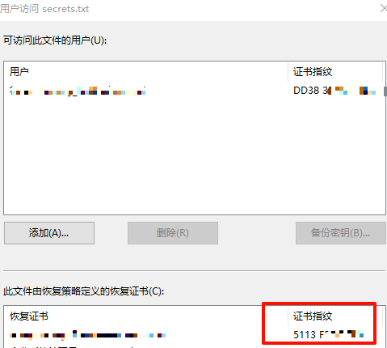

---
# 这是文章的标题
title: Windows：文件加密：EFS和PKI
# 这是页面的图标
icon: page
# 这是侧边栏的顺序
order: 83
# 设置作者
# 设置写作时间
date: 2024-02-05
# 一个页面可以有多个分类
category:
  - Windows
  - 文件加密
  - 信息安全

# 一个页面可以有多个标签
tag:
  - efs
  - pki
  - Information Security

# 此页面会在文章列表置顶
sticky: false
# 此页面会出现在文章收藏中
star: true

---

## 前言 

信息安全的文件加密应用场景还是很多的。企业中，Windows环境中，文件除了使用NTFS做权限控制，还想对文件加密防止数据泄密。

商业解决方案有很多种，比较重的有`Symantec PGP `磁盘加密，还有其他。普通的可以选择`Windows Bitlocker`分区和文件加密，以及基于用户的`Windows EFS`文件加密。 本文主要介绍使用EFS，Bitlocker和 EFS的比较放在文末。

## 正文

> EFS, `Encrypted File System`，使用的是公钥对文件进行加密。

### 简单介绍

- 使用的是用户公钥对文件进行加密，不是普通的密码保护；
- 不需要硬件支持；
- 需要NTFS文件系统；
- 加密后的文件，用户透明访问；其他用户则打不开，拷贝到其他位置或其他系统（重装系统）也不行。

### 普通使用

- 选择一个要加密的文件夹，【属性】、【高级】
- 勾起【加密内容以便保护数据】
- 这样文件就加密好了；加密后的文件上图标有一把黄色小锁，如下图：

- 备份和保管好证书私钥，以防系统重装或证书丢失后打不开加密文件；

### 最佳实践

- 准备AD域环境
- 准备部署企业证书CA
- 准备企业CA的EFS恢复代理证书模板
- 准备企业CA的用户EFS加密证书模板
- 指定企业EFS的恢复代理Data Recovery Agent(DRA)（用户证书丢失的备用恢复解决方案）

**1、准备AD域环境**

步骤略。企业一般都有AD域环境。有了AD部署组策略和证书颁发都很方便；

**2、准备部署企业证书CA机构**

步骤略。

即企业内部CA，用Windows证书服务机构即可，可以多级。有了内部CA，好处多多，可以根据不同需要创建证书模板：
- 内部有需要使用SSL加密通讯的Web服务都可以申请、颁发。
- 本文要使用EFS加密也可以使用指定用户证书模板和恢复代理模板；
- 802.1X/Radius认证、网络接入也可以使用，比较计算机证书模板；

**3、准备EFS恢复代理证书模板**

> 目的：即指定1个或多个企业（组织）内的EFS恢复代理用户，这样如果有用户的证书弄丢了，可以使用EFS恢复代理用户的证书来解密文件。

- 打开CA机构，找到【文件恢复代理】模板，复制1份，并重命名例如"MY_EFS_dra_certificates"。
- 【常规】，指定设置有效期，例如10年；
- 【常规】 勾上“允许发布到Active Directory" （可选）
- 【安全】，指定可以申请该证书的用户或组，一般是给域管理员，例如`Administrator`,确保ACL授权给用户或组勾上【申请】或【Enroll】。注意：勾掉其他用户；如下图：

**4、 准备用户的EFS证书模板**

>目的：准备用户的EFS证书模板给用户申请或自动颁发，用户申请到这个证书后就可以用来加密自己的文件。

- 打开CA机构，找到【用户】模板，复制1份，并重命名例如"MY_EFS_User_certificates"。我们选择这个模板而不是【EFS既不加密】模板，是因为这个模板的使用范围比较大，可以做文件加密用途，也可以做客户端身份验证，详见它的OID。
- 同样，设置模板属性，名称和有效期；
- 最重要的是，设置【安全】标签下的ACL， 我们允许所有【Authenticated Users】可以【申请】或【Enroll】；

**5、准备EFS恢复代理证书**
>目的: 需要准备一份EFS恢复代理证书，这证书要发放到所有域计算机，有可能使用EFS加密的系统上。

- 使用EFS恢复代理模板指定的授权账户登录到域控制器或是任意一台其他域成员服务器，在本例是`Administrator`。
- 启动`certmgr.msc`证书管理，展开【个人】、【证书】。右键【申请新证书】。
- 证书注册向导，选择【Active Directory】注册策略，【下一步】
- 选择 【恢复代理证书】模板，在本例是【My_EFS_DRA_Certificate】，完成步骤。
:::tip
如果申请时不见该模板，一般是在准备EFS恢复模板时，没有给对权限。
:::

- 完成证书安装；
- 右键选择【导出】证书。导出时，注意选择【同时导出私钥】。最后，导出的密钥文件一般是`xxx.pfx`
:::note
导出时注意可以考虑使用密码保护以及指定用户或组加强密钥安全。
:::

**6、发布和部署企业EFS恢复代理**

>目的：EFS恢复代理要下发到域计算机上，这样用户加密文件时才会把恢复代理加进去文件中，多一般钥匙。

- 把前面导出的恢复代理证书拷贝；
- 通过组策略，可以使用默认域策略也可以新建一个专门的组策略；
- 编辑组策略，【计算机配置】，【安全配置】、【EFS】
- 新增EFS恢复代理程序，指定pfx文件；

**7、用户申请EFS证书加密**

- 域用户登录后，即可申请EFS证书或是自动申请；
- 启动`certmgr.msc`证书管理，展开【个人】、【证书】。右键【申请新证书】。
- 证书注册向导，选择【Active Directory】注册策略，【下一步】
- 选择 【用户】模板，在本例是【My_EFS_User_Certificate】，完成步骤。
:::tip
如果申请时不见该模板，一般是在准备EFS恢复模板时，没有给对权限。
:::

**8、开始加密文件和文件夹**

步骤可以参考可以参考文章开头的【简单使用】。

**9、备份EFS证书密钥**

- EFS恢复代理管理员通过证书管理单元导出证书和私钥即可，然后保存到一个安全位置；
- 用户同样通过证书管理单元导出证书和私钥即可，然后保存到一个安全位置；用户重装了操作系统或丢失了备份证书私钥，可以寻求EFS恢复代理管理员帮忙解密文件。

:::note
注意保管好证书和私钥，考虑使用密码保护。如果不慎被其他人拿到，其他人则可以访问加密文件。
:::

**10、EFS恢复代理管理员如何协助用户解密**

- EFS恢复代理管理员登录到用户计算机；
- EFS恢复代理管理员把自己备份的证书私钥导入到用户计算机；
- 把加密文件和加密文件夹即可解密或使用`cipher /d`命令行工具；

**11、常见问题**

>EFS恢复代理也不能解密文件。

原因1：用户加密前，没有指定EFS恢复代理。

解决办法：如果用户也没有备份证书，没有办法解密，因此备份证书很重要。

原因2：使用错误的EFS恢复代理证书可能会解密失败，即用户加密时的EFS恢复代理证书和尝试解密的EFS证书不是同一个。

解决办法：

可以比对证书的指纹thumbprint，然后定位使用正确的。 步骤：
- 检查解密出问题的加密文件的属性，文件的加密属性里【详细信息】，可以看到加密时指定的EFS恢复代理证书和指纹。如下图：

- 检查导入的EFS恢复代理的证书指纹。如下图：

- 如果两个不同，则解密失败；导入加密时的EFS恢复证书。

## 扩展：BitLocker vs. Encrypting File System (EFS)

> Bitlocker比较适合外置磁盘加密，例如U盘

    BitLocker encrypts all personal and system files on the drive where Windows is installed, or on data drives on the same computer.
    EFS encrypts individual files on any drive.
    BitLocker does not depend on the individual user accounts associated with files. BitLocker is either on or off, for all users or groups.
    EFS encrypts files based on the user account associated with it. If a computer has multiple users or groups, each can encrypt their own files independently.
    BitLocker uses the Trusted Platform Module (TPM), a special microchip in some newer computers that supports advanced security features.
    EFS does not require or use any special hardware.
    You must be an administrator to turn BitLocker encryption on or off once it's enabled.
    You do not have to be an administrator to use EFS.
    You can use BitLocker Drive Encryption and the Encrypting File System together to get the protection offered by both features. When using EFS, encryption keys are stored with the computer's operating system. While these are encrypted, that level of security could potentially be compromised if a hacker is able to boot or access the system drive. Using BitLocker to encrypt the system drive can help protect these keys by preventing the system drive from booting or being accessed if it is installed into another computer.

## 参考

- [Stackflow: What are differences between EFS and BitLocker in Windows?](https://superuser.com/questions/527010/what-are-differences-between-efs-and-bitlocker-in-windows)

- [RouteUser:Configure the EFS Recovery Agent](https://www.rootusers.com/configure-efs-recovery-agent/)