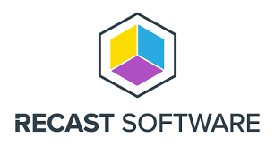
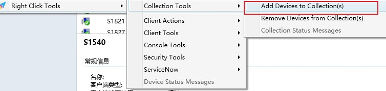
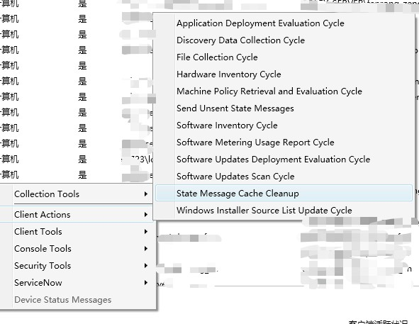

---
# 这是文章的标题
title: SCCM：效率工具：RECAST Software的Right Click Tools
# 这是页面的图标
icon: page
# 这是侧边栏的顺序
order: 27
# 设置作者
# 设置写作时间
date: 2023-05-12
# 一个页面可以有多个分类
category:
  - Windows
  - SCCM
  - 效率工具
# 一个页面可以有多个标签
tag:
  - SCCM
  - 效率工具

# 此页面会在文章列表置顶
sticky: false
# 此页面会出现在文章收藏中
star: true

---

## 介绍 

>a most powerful ConfigMgr plugin. 一个SCCM管理插件。

 

官网：https://www.recastsoftware.com/right-click-tools

### 版本

有免费社区版，也有企业版。社区版够用，免费使用3年。
最新版本是5.0。

### 功能

比较常用的:

- 批量导入对象（计算机/用户）到设备集合/用户集合中。最常用的
- 从控制台发起客户端的策略刷新、清除包缓存等动作；
- 从控制台检查客户端和组件状态、边界等信息；
- 还有很多控制台动作。例如：发送客户端组策略刷新等等；

几张图：

- Collection Actions:

- Client Actions:

