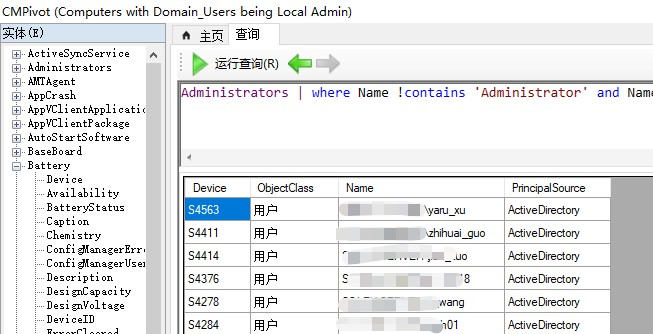

---
# 这是文章的标题
title: SCCM：效率工具：SCCM CMPivot报表工具
# 这是页面的图标
icon: page
# 这是侧边栏的顺序
order: 32
# 设置作者
# 设置写作时间
date: 2023-05-25
# 一个页面可以有多个分类
category:
  - Windows
  - SCCM
  - 效率工具
# 一个页面可以有多个标签
tag:
  - SCCM
  - 效率工具


# 此页面会在文章列表置顶
sticky: false
# 此页面会出现在文章收藏中
star: true

---


## 介绍 

>CMPivot 是SCCM内置报表工具。 可用于快速评估环境中设备的状态并采取措施。输入查询时，CMPivot 将在所选集合中当前连接的所有设备上实时运行查询。随后可筛选、组合和完善返回的数据，以解答业务问题、解决环境中的问题或响应安全威胁。。


### 版本

SCCM 1802以上版本

### 功能

比较常用的:

- 获取报告查询客户端的本地管理员组的成员；
- 获取报告查询客户端的开启的共享文件夹；


### 使用方法和步骤

- 选择一个计算机集合 （Windows 10)
- 右键集合名称，点击`启动CMPivot`
- 新建一个查询；
- （可选）根据查询结果，创建一个新集合；

```sql
Administrators | where Name !contains 'Administrator' and Name !contains 'Domain Admins' and Name !contains 'Helpdesk Admins' 
```

**图：范例**




## 题外

很多时候企业不希望普通用户拥有本地管理员权限。既然刷出了本地管理员报告，顺便说怎么处理移除本地管理员，以遵循安全策略和最佳实践。

### 使用SCCM基线基准

- 在SCCM CMPivot刷出计算机列表后，立马根据报告结果创建一个新的计算机集合。
- 在SCCM `符合性设置`里创建一个基线项目；

**发现脚本（符合条件）**

```Powershell
if (Get-LocalGroupMember -Group "Administrators" -Member "My-Domain-Name\Domain Users" -ErrorAction SilentlyContinue) 
  {   
          return $false 
  }

  else {   
          return $true
  }
```

**修正脚本**

```Powershell
Remove-LocalGroupMember -Group "Administrators" -Member "My-Domain-Name\Domain Users"
```

- 最后，部署基线到新集合。