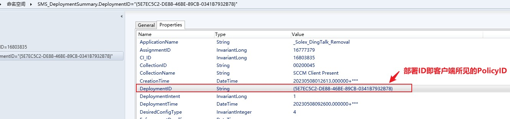

---
# 这是文章的标题
title: SCCM：问题排查1：跟踪部署策略的执行过程
# 这是页面的图标
icon: page
# 这是侧边栏的顺序
order: 25
# 设置作者
# 设置写作时间
date: 2023-05-10
# 一个页面可以有多个分类
category:
  - Windows
  - SCCM
# 一个页面可以有多个标签
tag:
  - SCCM
  - 疑难排查
  - Troubeshooting


# 此页面会在文章列表置顶
sticky: false
# 此页面会出现在文章收藏中
star: true

---


## Purpose

See SCCM deployment task is not completed and worked as unexpected. As a result, app/package/compliance baseline was not executed and installed. need to find out 

- why my deployment went wrong.
- in what phrase the deployment get stuck

so in this post, I wanted to demonstrate myself how to track down a deployment process and what to look into when starting a troubelshooting.

### SCCM Logging

SCCM  offers a bunch of very useful log files on CCM client side for admin to track how the policy is executed. Locate these log files on client side 
`c:\windows\ccm\logs`. 

### Policy ID

Before we start following through a deployment process ,first thing is to find out the policy ID which is the very important piece of info we needed to start the troubleshooting journey.

Generally, a deployment from SCCM server is treated by CCM client as a policy so policyId is the deploymenId, they are the one and same . Follow the steps below to find out the policy ID:

- Open up SCCM admin console in `debugView' mode. Otherwise, PolicyID wouldn't be shown up.
```cmd
"C:\Program Files (x86)\Microsoft Configuration Manager\AdminConsole\bin\Microsoft.ConfigurationManagement.exe" sms:debugview
```
- Go to `Monitoring`
- Locate the deployment task you want to track down;
- Right click the deployment and click `show object details`
- DeploymentID could be seen in a list of `Properties` fileds.
in this demo, the deploymentID/PolicyID is `{5E7EC5C2-DE88-46BE-89CB-0341B7932B78}`




### PolicyAgent.log

> Once we have the policyID, let's start with `policyAgent.log` becasue it is first stop that our policy shoud come in. 

- in this demo,  the policy `{5E7EC5C2-DE88-46BE-89CB-0341B7932B78}` is being downloaded by DTS (DataTransferService) and assined to DTS download job id `{B45955B6-1902-4FCA-93BD-921DB7B317DC}`

```
[Download of policy CCM_Policy_Policy5.PolicyID="{5E7EC5C2-DE88-46BE-89CB-0341B7932B78}",PolicySource="SMS:002",PolicyVersion="1.00" completed (DTS Job ID: {B45955B6-1902-4FCA-93BD-921DB7B317DC})]LOG]!><time="15:30:15.759-480" date="05-09-2023" component="PolicyAgent_PolicyDownload" context="" type="1" thread="4088" file="policydownloadendpoint.cpp:608">
<![LOG[Raising event:

instance of CCM_PolicyAgent_PolicyDownloadSucceeded
{
	ClientID = "GUID:9EC29837-CBA8-48B7-AFC1-78BBD2F456DE";
	DateTime = "20230509073015.769000+000";
	DownloadMethod = "BITS";
	DownloadSource = "http://XMPRITSCCM01.example-server.com/SMS_MP/.sms_pol?{5E7EC5C2-DE88-46BE-89CB-0341B7932B78}.SHA256:1D9B44CB35C72CBE30FD27A2CF753814E418BB217120E60E841904430090DF97";
	PolicyNamespace = "\\\\.\\ROOT\\CCM\\Policy\\Machine\\RequestedConfig";
	PolicyPath = "CCM_Policy_Policy5.PolicyID=\"{5E7EC5C2-DE88-46BE-89CB-0341B7932B78}\",PolicySource=\"SMS:002\",PolicyVersion=\"1.00\"";
	ProcessID = 5436;
	ThreadID = 4088;
};
```


### DataTransferService.log 

> here to check how the download goes

our job id was {B45955B6-1902-4FCA-93BD-921DB7B317DC} which is completed with no error.

```
<![LOG[DTSJob {B45955B6-1902-4FCA-93BD-921DB7B317DC} created to download from 'http://XMPRITSCCM01.example-server.com:80/SMS_MP' to 'C:\Windows\CCM\Temp'.]LOG]!><time="15:30:09.905-480" date="05-09-2023" component="DataTransferService" context="" type="1" thread="4352" file="datatransferservice.cpp:330">
（略）
<![LOG[DTSJob {71EF16C0-CF7B-4209-AAC7-266900265D9D} successfully completed download.]LOG]!><time="15:30:11.295-480" date="05-09-2023" component="DataTransferService" context="" type="1" thread="3608" file="dtsjob.cpp:4010">
<![LOG[DTSJob {71EF16C0-CF7B-4209-AAC7-266900265D9D} in state 'NotifiedComplete'.]LOG]!><time="15:30:11.311-480" date="05-09-2023" component="DataTransferService" context="" type="1" thread="7840" file="DTSJob.h:180">
<![LOG[DTS job {71EF16C0-CF7B-4209-AAC7-266900265D9D} has completed:
	Status : SUCCESS,
	Start time : 05/09/2023 15:30:09,
	Completion time : 05/09/2023 15:30:11,
	Elapsed time : 1 seconds]LOG]!><time="15:30:11.313-480" date="05-09-2023" component="DataTransferService" context="" type="1" thread="7840" file="util.cpp:3436">

<![LOG[DTS job {B45955B6-1902-4FCA-93BD-921DB7B317DC} has completed:

```


### policyEvaluator.log

> here to check how the policy is being evaulated and complied and applied.

```
]LOG]!><time="15:30:15.885-480" date="05-09-2023" component="PolicyAgent_PolicyEvaluator" context="" type="1" thread="4088" file="Event.cpp:840">
<![LOG[Applied policy CCM_Policy_Policy5.PolicyID="{5E7EC5C2-DE88-46BE-89CB-0341B7932B78}",PolicySource="SMS:002",PolicyVersion="1.00"]LOG]!><time="15:30:15.890-480" date="05-09-2023" component="PolicyAgent_PolicyEvaluator" context="" type="1" thread="4088" file="policyutil.cpp:9196">

```
if sucessful, the policy is being appled.

```
<![LOG[Applying policy {5E7EC5C2-DE88-46BE-89CB-0341B7932B78}]LOG]!><time="15:30:15.845-480" date="05-09-2023" component="PolicyAgent_PolicyEvaluator" context="" type="1" thread="4088" file="policyutil.cpp:6357">
<![LOG[Updating policy CCM_Policy_Policy5.PolicyID="{e5829a2d-64c1-48fc-be23-69d1c5ea810d}",PolicySource="SMS:002",PolicyVersion="9.00"]LOG]!><time="15:30:15.856-480" date="05-09-2023" component="PolicyAgent_PolicyEvaluator" context="" type="1" thread="9116" file="policyutil.cpp:9115">
<![LOG[Raising event:

instance of CCM_PolicyAgent_PolicyRuleApplied
{
	ClientID = "GUID:9EC29837-CBA8-48B7-AFC1-78BBD2F456DE";
	DateTime = "20230509073015.884000+000";
	PolicyID = "{5E7EC5C2-DE88-46BE-89CB-0341B7932B78}";
```

### Final Stop

- Final #Destination 1: Execmgr.log (Package Deployment)
- Final #Destination 2: AppEnforce.log (Application Deployment)
- Final #Destination 3: DCMAgent.log /CIAgent.log  (Compliance Baseline Deployment)

**Final stop to check for admin vary depending on the deployment types listed above.**  in this demo, it is `Compliance Baseline Deployment`

### DCMAgent.log

For compliance evaluation policy,
 finally, policy is being assigned into a DCM job `{4A02F07C-F786-4EDD-9674-CA4B6893FD16}`)by DCM Agent


```
<![LOG[DCMAgentJob({4A02F07C-F786-4EDD-9674-CA4B6893FD16}): CDCMAgentJob::SetupJob - Add assignment _example_DingTalk_Removal_SCCM Client Present({5E7EC5C2-DE88-46BE-89CB-0341B7932B78})]LOG]!><time="08:22:49.152-480" date="05-10-2023" component="DCMAgent" context="" type="1" thread="8676" file="dcmagentjob.cpp:3251">

<![LOG[DCMAgentJob({4A02F07C-F786-4EDD-9674-CA4B6893FD16}): CDCMAgentJob::PopulateCIsFromAssignment - [SCAN] CI policy Id :ScopeId_46E06C1F-1234-4969-A016-8C1CFC11DAB5/Baseline_e8da6249-e3ae-4f6e-a154-0aa1c96931c2 version:1 - Assignment:{5E7EC5C2-DE88-46BE-89CB-0341B7932B78} is not mandatory.]LOG]!><time="08:22:49.177-480" date="05-10-2023" component="DCMAgent" context="" type="1" thread="8676" file="dcmagentjob.cpp:3251">
<![LOG[CDCMAgentJobMgr::StartJob - Starting DCM Agent job {4A02F07C-F786-4EDD-9674-CA4B6893FD16}]LOG]!><time="08:22:49.180-480" date="05-10-2023" component="DCMAgent" context="" type="1" thread="8676" file="dcmagentjobmgr.cpp:444">
```
- DCMAgent started a CI job CI Agent Job `{F2C3175D-A639-4993-83E3-70E9F07C18D7}`

```
<![LOG[DCMAgentJob({4A02F07C-F786-4EDD-9674-CA4B6893FD16}): CDCMAgent::InitiateCIAgentJob - Starting CI Agent Job {F2C3175D-A639-4993-83E3-70E9F07C18D7} for target: machine. Refer to this CI agent job ID in ciagent.log for more details]LOG]!><time="08:22:49.210-480" date="05-10-2023" component="DCMAgent" context="" type="1" thread="8068" file="dcmagentjob.cpp:3251">
```


###  CIAgent.log

here to  check CI job details. Our Compliance Evaluatiion is being evaluated on client

```
<![LOG[CIAgentJob({F2C3175D-A639-4993-83E3-70E9F07C18D7}):  CI ScopeId_46E06C1F-1234-4969-A016-8C1CFC11DAB5/Baseline_e8da6249-e3ae-4f6e-a154-0aa1c96931c2:1 (_example_DingTalk_Removal) targeted to  (Dependant of policy CI ScopeId_46E06C1F-1234-4969-A016-8C1CFC11DAB5/Baseline_e8da6249-e3ae-4f6e-a154-0aa1c96931c2:1) is in scope for evaluation.]LOG]!><time="08:22:52.435-480" date="05-10-2023" component="CIAgent" context="" type="1" thread="8676" file="agentjob.cpp:3284">
```

### that's it. Journey is over.
