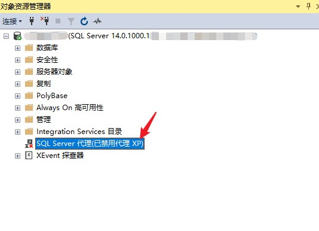
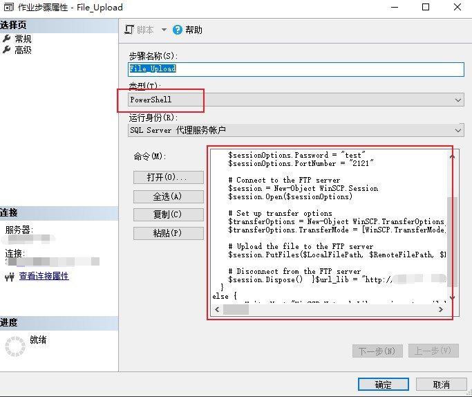
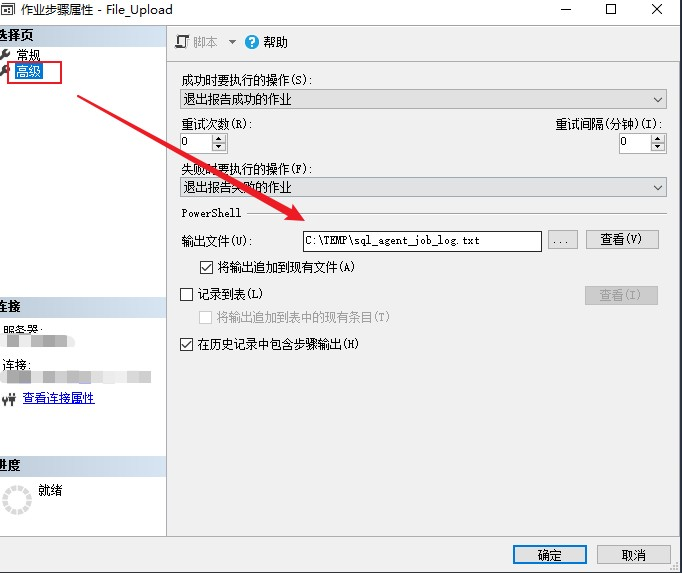
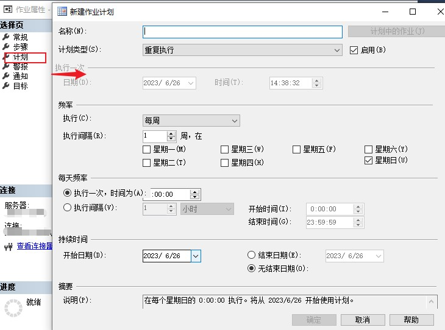

---
# 这是文章的标题
title: 脚本编程：Powershell：在SQL Server的SQL Agent里执行Powershell脚本
# 这是页面的图标
icon: page
# 这是侧边栏的顺序
order: 41
# 设置作者
# 设置写作时间
date: 2023-06-26
# 一个页面可以有多个分类
category:
  - Scripting Language
  - 脚本编程
  - Powershell

# 一个页面可以有多个标签
tag:
  - Powershell
  - SQLServer

  

# 此页面会在文章列表置顶
sticky: false
# 此页面会出现在文章收藏中
star: true

---

:::tip 背景
有个需求就是：在没有SQL Server服务器操作系统账户、只有数据库账户sa情况下，把远程SQL服务器上的某个文件上传到sftp服务器。前面尝试使用存储过程`xp_cmdshell`执行Powershell脚本来完成，但没有成功，没成功的原因可能是脚本内容有一下特殊字符，包裹在xp_cmdshell的`cmd_string`里转义失败。后来 发现通过`SQL Agent`的job作业也可以执行Powershell脚本，而且更方便强大，可以计划调度运行。
:::

## SQL Server Agent介绍

>SQL Server 代理是一项 Microsoft Windows 服务，它在执行计划的管理任务，这些任务 SQL Server 中被称为“作业”.SQL Server 代理使用 SQL Server 存储作业信息。 作业包含一个或多个作业步骤。 每个步骤都有自己的任务。例如，备份数据库。SQL Server 代理可以按照计划运行作业，也可以在响应特定事件时运行作业，还可以根据需要运行作业。 例如，如果希望在每个工作日下班后备份公司的所有服务器，就可以使该任务自动执行

>支持很多脚本语言。例如SQL/Powershell/cmdExec

## 使用SQL Server Agent执行Powershell脚本

>默认情况下，SQL Server 安装后 SQL Server 代理服务处于禁用状态，除非用户明确选择自动启动该服务。

- 登录SQL Server Management Studio。
- 启动SQL Server Agent服务。右键[SQL Server代理]，点击“启动”。

- 新建作业。作业内容有：动作步骤，、计划时间以及通知等。

- 新建一个作业步骤。并指定作业类型为`Powershell`.

- 点击【打开】定位到写好的Powershell脚本文件然后加载。

- 点击【高级】标签页，指定作业输出文件。如果脚本没有按照预期执行，可以通过查看输出检查脚本。

- 设置作业执行计划。

- 设置作业执行结果通知。支持邮件等通知，步骤略。

:::tip 关于SQL Agent作业运行身份
默认SQL Agent服务是使用一个叫`SQL Server 代理服务账户`，这是一个`虚拟服务账户`(Virtual Account) ,点击[这里了解什么是虚拟账户](https://learn.microsoft.com/en-us/sql/database-engine/configure-windows/configure-windows-service-accounts-and-permissions?redirectedfrom=MSDN&view=sql-server-ver16#VA_Desc) 应该是权限比较低的账户，不能执行一些权限要求高的任务。如果需要执行，需要在服务管理把服务账户换成高权限账户。
:::

## Side Notes 1: 关于文件上传脚本

实现原理是通过WinSCP的运行库实现的，通过sftp协议上传文件到远程sftp服务器。脚本将在下一个文章介绍。