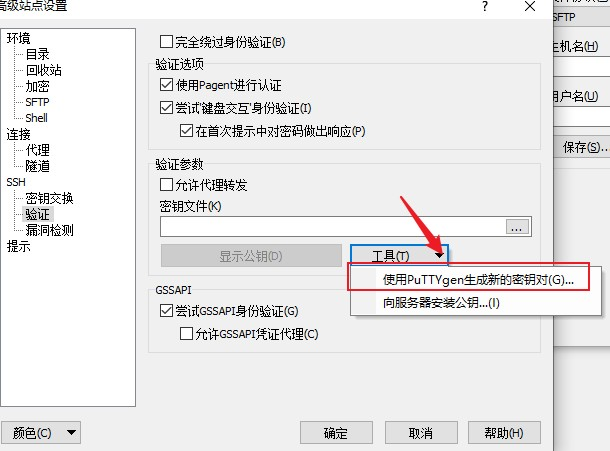
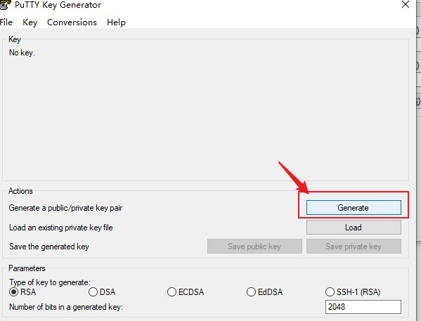
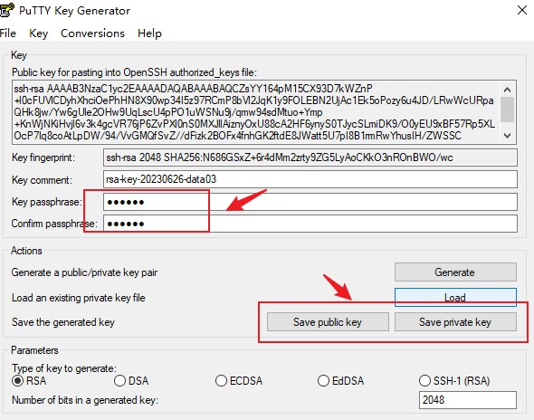
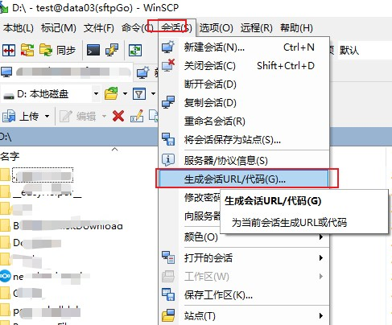
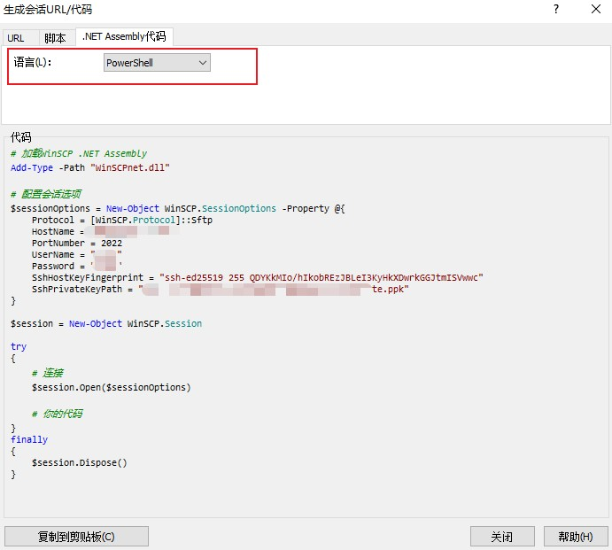

---
# 这是文章的标题
title: 脚本编程：Powershell：使用WinSCP Assembly实现文件上传
# 这是页面的图标
icon: page
# 这是侧边栏的顺序
order: 42
# 设置作者
# 设置写作时间
date: 2023-06-26
# 一个页面可以有多个分类
category:
  - Scripting Language
  - 脚本编程
  - Powershell

# 一个页面可以有多个标签
tag:
  - Powershell
  - WinSCP
  - sftp
  - 文件上传
  - 效率提升
  - 大文件传输

  


# 此页面会在文章列表置顶
sticky: false
# 此页面会出现在文章收藏中
star: true

---

:::tip 背景
前篇文章 [在SQL Agent里运行Powershell实现文件上传](https://blog.solex-inc.com/zh/%E4%BF%A1%E6%81%AF%E6%8A%80%E6%9C%AF/%E7%BC%96%E7%A8%8B/post41_ps_run_in_sql_with_sql_agent.html)介绍了一个文件上传需求，把远程SQLServer上的一个文件上传到sftp服务器。具体实现是通过Powershell调用WinSCP的Assembly实现的，本篇详细介绍。
:::


## 先说WinSCP

>WinSCP是Windows下一个很常用、很受欢迎的开源FTP/SFTP客户端，版本更新的很快。

官方主页 https://winscp.net/eng/download.php
sha'g
 WinSCP supports five transfer protocols:

    SFTP (SSH File Transfer Protocol);
    FTP (File Transfer Protocol);
    SCP (Secure Copy Protocol);
    WebDAV (Web Distributed Authoring and Versioning);
    S3 (Amazon S3).

>另外，还提供了Assembly（API)，可以编程实现文件上传、下载和同步功能，本文重点。


## 实现


:::tip
以下是使用sftp协议举例实现文件上传，FTP实现差不多.
:::

### 准备工作

- 1台可运行sftp服务器（可以使用 [sftpGo](https://github.com/drakkan/sftpgo) 实现部署）和账户，步骤略。
- WinSCP Assembly文件
- sftp账户公钥和私钥。


### 脚本


[完整脚本](https://github.com/100vision/Powershellgallery/blob/master/%E7%BD%91%E7%BB%9C%E7%B1%BB/%E6%96%87%E4%BB%B6%E4%B8%8A%E4%BC%A0/Upload-FileBySFTP.ps1)

``` Powershell

<#
 - Function: File Uploading through WinSCP/sftp with SSL Auth option, without clear text password provided
 - Prerequisites: WinSCP Assembly
 - Author: tlin82

#>

Function Upload-FileBySFTP() {

param (
        [string]$LocalFilePath,
        [string]$RemoteFilePath
        )

    #Load WinSCP Assembly
    Add-Type -Path "C:\ssh\WinSCPNet.dll"

    # Set up session options for a SFTP Session
    # follow code snippet can be generated by WinSCP Session Code Template Generator. See WinSCP documentation for details.
    $sessionOptions = New-Object WinSCP.SessionOptions -Property @{
        Protocol = [WinSCP.Protocol]::Sftp
        HostName = "my-sftp-server.example.com"
        PortNumber = 2022
        UserName = "test"
        SshHostKeyFingerprint = "ssh-ed25519 255 QDYKkMIo/hIkobREzJBLeI1KyHkXDwrkGGJtmISVwwc"
        ##Private Key
        SshPrivateKeyPath = "C:\ssh\private.ppk"
        # Use Pass phrase to protect the private key
        PrivateKeyPassphrase = "acJ-Ub-YHgloHh7hbR6a"

    }


    # Set up transfer options
    $transferOptions = New-Object WinSCP.TransferOptions
    $transferOptions.TransferMode = [WinSCP.TransferMode]::Binary
    #Speed limit to 500KB/s
    $transferOptions.SpeedLimit = 500
    # Enable Resume Support for all files.
    $transferOptions.ResumeSupport.State = [WinSCP.TransferResumeSupportState]::On


    $session = New-Object WinSCP.Session
    try
    {
        # Connection
        $session.Open($sessionOptions)

      # Upload the file to the FTP server
        $session.PutFiles($LocalFilePath, $RemoteFilePath, $False, $transferOptions).Check()

    }

    finally
    {
        $session.Dispose()
    }
    

}


if (Test-Path -Path "C:\ssh\WinSCPNet.dll") {

    Upload-FileBySFTP -LocalFilePath "D:\source\file_to_be_uploaded.zip" -RemoteFilePath "/file_to_be_uploaded.zip"


  }


# Provision WinSCP assembly on the server where the file is uploaded from. The assebmly can be found in WinSCP install directory.
# if not available on the server, either download from a http server that holds the WinSCP assembly. In this case, the http server is served with Node.js Express, a simple http server.
# Alternatively get a copy of the assembly files from anywhere else . Whatever,as long as the assembly is available for the file uploading function to load.


else {
        $url_lib = "http://http-server:3000/download/1"
        $outputPath_lib = "C:\ssh\WinSCPNet.dll"

        $url_exec = "http://http-server:3000/download/2"
        $outputPath_exec = "C:\ssh\WinSCP.exe"

        $url_sslKey = "http://http-server:3000/download/3"
        $outputPath_sslKey = "C:\ssh\private.ppk"

        $webClient = New-Object System.Net.WebClient
        $webClient.DownloadFile($url_lib, $outputPath_lib)
        $webClient.DownloadFile($url_exec, $outputPath_exec)
        $webClient.DownloadFile($url_sslKey, $outputPath_sslKey)

        Upload-FileBySFTP -LocalFilePath "D:\source\file_to_be_uploaded.zip" -RemoteFilePath "/file_to_be_uploaded.zip"
  }
```


### 脚本详细说明

1. **关于WinSCP Assembly文件准备细节**

- WinSCP Assembly文件至关重要，需要在要上传的主机（在本例，是在一台远程SQL Server) 上准备好，这样上传脚本才能工作。
- 这些Assembly文件是： `WinSCP.exe` 和 `WinSCPNet.dll`,均可以在WinSCP安装目录中找到。如果上传主机没有安装WinSCP,可以通过其他方法准备一份(例如通过http)，放到一个上传主机的某个指定目录下。在例子，我指定了`C:\ssh`。
- 最后在脚本中使用`Add-Type`指令指定并加载。

:::note
`WinSCP.exe` 和 `WinSCPNet.dll` 必须在同一目录下。
:::

2. **如果上传主机上没有安装WinSCP Assembly文件**

可以搭建一个简单的HTTP服务器，并使用脚本的`webclient`对象实现下载一个副本。本例中，是使用`Node.js` 的express部署一个http，提供下载WinSCP.exe和WinSCPNet.dll，以及sftp ssh私钥key。

3. **关于免密登录sftp服务器的实现细节**

免密登录是因为使用了SSH密钥对.

- 密钥对通过WinSCP/putty工具生成。
- 然后提前把公钥通过WinSCP下的putty上传到sftp用户主目录下。本例中使用的sftp服务器是sftpGo，是把公钥文本拷贝粘贴到用户profile里保存（通过sftpGO Web admin portal)。

:::tip 
可以先通过WinSCP工具测试是否可以免密登录sftp服务器。
:::

4. **关于脚本中sftp SessionOption对象会话选项参数**

WinSCP的会话参数是通过WinSCP会话工具代码模板生成器生成的，比较方便。使用方法是：

- 启动WinSCP，新建站点，并生成密钥对用于登录sftp服务器；




- 登录成功后，点击菜单上的【会话】，点击【代码生成】如下图：



- 复制代码模板到Powershell ISE或其他IDE，最后再写文件上传代码
