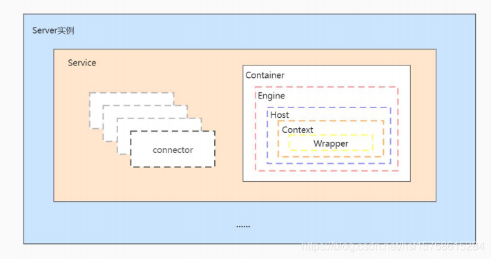

---
# 这是文章的标题
title: Web服务器:Tomcat学习系列：Tomcat内部组成（转载）
# 这是页面的图标
icon: page
# 这是侧边栏的顺序
order: 61
# 设置作者
# 设置写作时间
date: 2023-10-08
# 一个页面可以有多个分类
category:
  - DevOps
  - 工具
  - Web
# 一个页面可以有多个标签
tag:
  - DevOps
  - 工具
  - Tomcat
  - java
  - 开放框架


# 此页面会在文章列表置顶
sticky: false
# 此页面会出现在文章收藏中
star: true
# 你可以自定义页脚
footer: 
# 你可以自定义版权信息
copyright: 无版权
---


## 前言

看到一篇写的很好Tomcat组成，全文转载。

>Tomcat作为一款Web服务器产品，主要有两个角色，`Connector` 和 `Servlet`。

- 一个是作为一个Http服务器，接收和响应Http请求,对应的是Tomcat的`Connector`组件；
- 另一个则是Servlet容器，存储和处理所有应用的Servlet 实例，对应的是Tomcat的Web容器组件；

## 正文

### Connector

当一个请求进来的时候，Connector负责解析请求信息，并封装成一个ServletRequest 对象，交给容器。

Connector由以下3个组件组成：

- `EndPoint`, 监听 Socket 请求，实现Socket的接收和发送，是传输层的抽象，实现TCP/IP协议
- `Processor`, 用来接收EndPoint传递过来的字节流，将字节流转化成Request，实现Http协议
- `Adapter`, 适配器，这里主要是将Request适配成容器可接收的ServletRequest。


### Servlet (Catalina容器)



Tomcat启动的时候就会创建Server 实例，其他实例是通过解析server.xml完成创建。

- 一个Server实例包含多个Service实例，`我的理解：例如按业务分Service`

- 一个Service实例包含多个connector实例和一个Container实例。`我的理解：一个connector代表一个监听服务端口。例如:443,:8080`


- Container实例包含一个`Engine`实例，一个Engine实例可以有多个Host，

- 一个Host就代表一个站点。例如：
```
abc.com
123.com
```


- Context则表示一个 Web 应用。例如：
```
/orders
/products
```
一个站点下面可以有多个应用，Context对应就是`webapp`下的每个项目。


所以最终当一个请求进来的时候，Tomcat会通过连接器Coyote组件完成请求路径的解析，进而将请求交给Catalina容器去指定的对应的Servlet容器执行。


## 参考

[浅谈Tomcat的体系结构](https://blog.csdn.net/lveex/article/details/109044237)