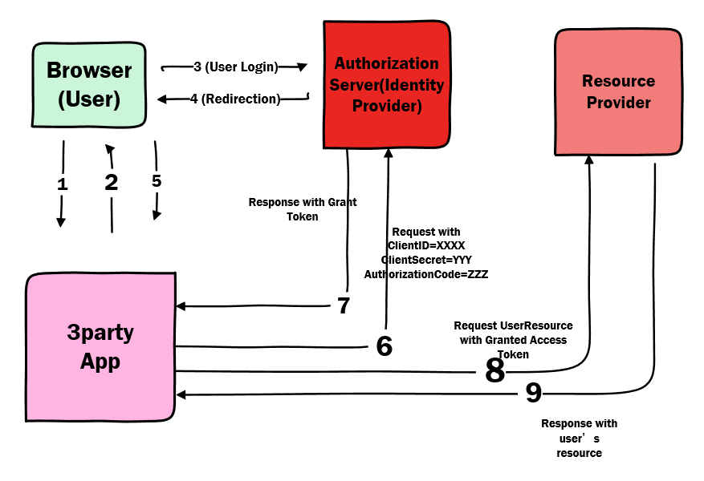

---
# 这是文章的标题
title: 开发学习:身份认证:OAuth 2.0粗解
# 这是页面的图标
icon: page
# 这是侧边栏的顺序
order: 63
# 设置作者
# 设置写作时间
date: 2023-10-09
# 一个页面可以有多个分类
category:
  - Web
# 一个页面可以有多个标签
tag:
  - OAuth
  - 身份认证
  - 令牌
  - java
  - 开发框架

# 此页面会在文章列表置顶
sticky: false
# 此页面会出现在文章收藏中
star: true
# 你可以自定义页脚
footer: 
# 你可以自定义版权信息
copyright: 无版权
---

## 前言

学习和了解OAuth认证授权机制。OAuth是用的比较多的身份认证，资源授权机制，微信和企业微信。

很多使用场景，很多第三方应用支持使用微信和Google账户（拥有大量用户账户资源等）登录他们的服务和应用，用户不要额外申请和注册账户。这当中使用的就是OAuth 2.0授权机制。

## 正文

### OAuth授权工作流

看到阮一峰的博客[这里](https://www.ruanyifeng.com/blog/2019/04/oauth_design.html) 画了一个图，不知道对不对。

1. 用户（浏览器）使用和访问第三方服务（网站或应用。（第三方服务支持Google账户/Apple账户登录）

2.  第三方服务返回(return 302/301) 并重定向用户（浏览器）到用户的认证服务器。（携带第三方的Callback回调url)

3、用户登录自己的身份认证服务器，认证服务器会询问用户是否授权第三方服务访问自己的账户信息（资源），例如邮件地址/ID/头像等。

4. 用户授权后，用户的账户认证服务器返回授权码并重定向用户（浏览器）到第三方服务（携带。

5. 用户（浏览器）被重定向后会携带授权码给第三方服务。

6. 第三方服务（一般是后端）接收到授权码，由第三方的后端提交申请，申请带上授权码/Client_ID/Client_Secret到用户的认证服务器。用户（浏览器）不可见。

7. 用户的认证服务器验证后，颁发access token，以json形式返回。

8. 第三服务（后端）收到token后，带上token（http header里的authorization字段）访问用户的资源（例如email/ID等）

9. 资源服务器返回用户资源给第三方服务。

使用案例：现在很多网站支持使用Google账户/微信第三方账户等登录他们的服务，就是oAuth的实现。

这种情景案例下，各角色：
- 网站是第三方服务。
- 微信账户提供商是认证服务商。
- 用户的微信账户等是用户的资源；
- 网站要用户授权，才能访问用户的微信账户资源，例如微信，头像。
- 网站拿到google账户

可以看到，

- 用户没有把用户和密码提交给第三方服务，安全可以保障。
-  第三方服务一开始拿到是一个authorization code，然后才是token令牌（有有效期的，用户可以撤销）。
- 第三方需要带上authorization code和表明自己身份的client_id/client_secret，才能从用户的认证服务商商拿到token. 这个client_id和secret需要第三方服务的开放者事先到身份提供商去备案申请。

### OAuth 客户端注册和创建

>如果你的网站服务需要支持用户使用Google或微信账户登录，则需要去这些身份提供商备案申请，其实就是申请创建一个身份提供商的OAuth Client客户端，表明身份。申请过程可能需要指定：

- 指定资源scope。即要获取用户的什么资源；
- 其他信息（例如联系人email等。

创建后，提供商颁发client id和secrect。

- 微信

https://cloud.tencent.com/developer/article/1447723

- Google OAuth 
https://console.cloud.google.com/apis/credentials

