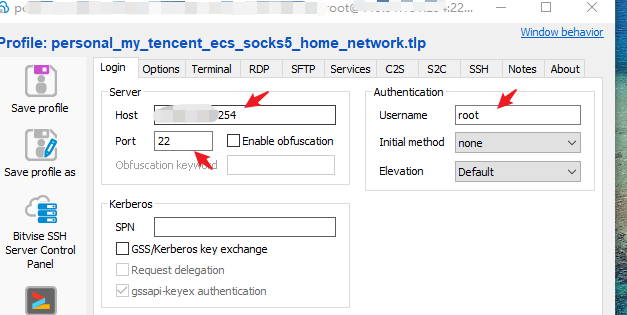
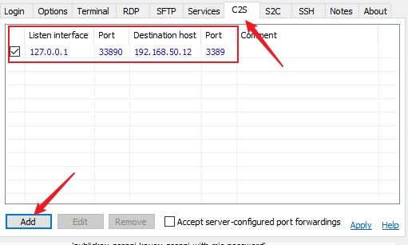
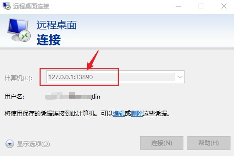
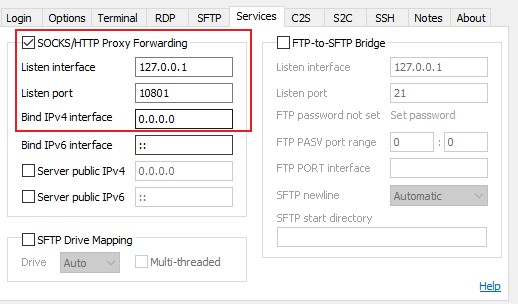

---
# 这是文章的标题
title: Networking：代理上网：使用SSH Tunnel隧道代理来访问远程服务
# 这是页面的图标
icon: page
# 这是侧边栏的顺序
order: 58
# 设置作者
# 设置写作时间
date: 2023-09-13
# 一个页面可以有多个分类
category:
  - networking
  - 代理上网
  - productivity
# 一个页面可以有多个标签
tag:
  - networking
  - proxy
  - SSH
  - RDP
  - Socks5
  - Bitvise

  
# 此页面会在文章列表置顶
sticky: false
# 此页面会出现在文章收藏中
star: true
# 你可以自定义页脚
---


## 前言

一直在使用SSH隧道做http、socks5代理实现上网、联网。简单说，就是使用SSH服务器作为中转跳板，连接到其他服务器或服务。


## 使用场景

**场景1：使用SSH通道访问远程服务**

> 当前所在的网络有很严格的网络限制，目标端口只有开放22端口（SSH服务器），没有办法直接访问远程目标服务，例如MySQL Server（端口3306）,但SSH服务器可以到达MySQL服务器。

**实现原理**

> SSH通道和端口转发.

流量路径：

```
本地客户端应用 (3306) <—> 本地代理端口 <-> 【本地ssh客户端端口】  *****> 【SSH服务器端口】 <——> remote system (3306)
```

- 客户端应用程序转发流量到本地代理端口
- 客户端应用流量走SSH通道到达SSH服务器
- SSH服务器把流量转发给远程服务；


**场景2：使用SSH通道代理上网**

> 解决上网问题。本机因网络限制（条件限制）无法上网，但可以连接到但SSH服务器,SSH服务器可以连接到Internet。

**实现原理**

> 使用一些SSH工具（产品）作为Socks5或HTTP代理,代理后的流量走SSH通道出去/回来。

流量路径：

```
本地客户端应用/浏览器 —> 本地socks5/http代理端口 <-> 【本地ssh客户端端口】  *****> 【SSH服务器端口】 <—> remote system (3306)
```

## 具体实现

:::准备
一个远程SSH服务器的SSH凭据（账户密码）
:::

### Windows

> Windows下可以使用Bitvise SSH Client实现以上2种场景需求。


- 首先：不管哪种需求，先建立一个SSH连接(有些应用自带ssh功能例外，例如navicat)




**实现举例：代理远程桌面服务**

 - 设置Bitvise SSH代理RDP服务（例如：Microsoft RDP）。添加一个Client-to-server项目。

 



其中`Port`是本地代理端口，`Destination host`是我的目标远程RDP主机；`Destination Port` 是目标RDP端口


- 发起一个Microsoft RDP发起连接。目标端口是本地代理端口。




**实现举例：Http/Socks5代理**

 - 设置Bitvise SSH作为本地的Sock5/HTTP代理 

 

- 设置应用使用代理（具体设置步骤代理参考应用帮助）。

:::tip
注意：如果浏览器如果要使用Socks5代理需要按照OmegaSwitchy扩展。
:::


### Linux

> Linux下可以使用OpenSSH创建ssh通道并启动socks5代理

**如果应用支持Socks5代理**

- 步骤1：使用`ssh -D` 建立一个SSH连接。

```
#举例：建立ssh连接，并启动一个本地端口12345作为本地socks5代理
$ ssh -D 12345 myuser@remote_ssh_server
```

- 步骤2：设置应用使用socks5代理参数（选项）。设置具体步骤参考应用帮助文档

**如果应用不支持Socks5代理**

如果应用不支持socks5代理，只支持http代理，则：

- 步骤1：使用`ssh -D` 建立SSH连接。

```
#举例：建立ssh连接，并启动一个本地端口12345作为本地socks5代理
$ ssh -D 12345 myuser@remote_ssh_server
```

- 步骤2：在本地添加使用一个http代理，例如`Privoxy`，设置它的上游upstream代理socks5。

```
forward-socks5   /               localhost:12345

#/etc/privoxy/config
# 更多privoxy选项 http://www.privoxy.org/user-manual/config.html
```
- 步骤3：设置应用使用Privoxy的http代理。


这样流量路径是：
```
本地应用 <-> Privoxy （http代理）<-> 本地socks5代理(12345) <-> ssh tunnel <-> 远程服务
```


