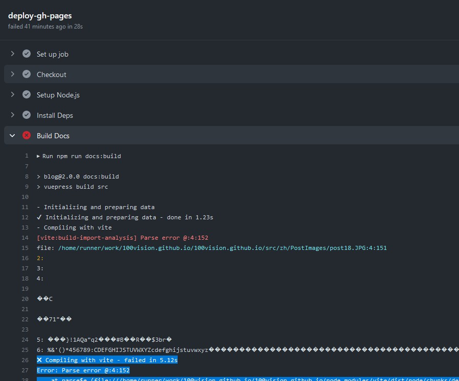
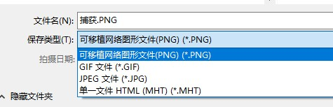

---
# 这是文章的标题
title: 关于本主题博客插入图片注意事项
# 这是页面的图标
icon: page
# 这是侧边栏的顺序
order: 26
# 设置作者
# 设置写作时间
date: 2023-05-11
# 一个页面可以有多个分类
category:
  - 随笔
  - 博客
# 一个页面可以有多个标签
tag:
  - 随笔

# 此页面会在文章列表置顶
sticky: true
# 此页面会出现在文章收藏中
star: true
# 你可以自定义页脚
footer: 
# 你可以自定义版权信息
copyright: 无版权
---


## 困扰

本博客程序插入图片一直不成功，`そんな難しい問題だ、困ります`

:::tip 先说结论
博客不支持插入文件名含有**英文大写**的静态资源文件。例如`.JPG`、`.PNG`，还没有查出原因, 写篇笔记提醒自己。
:::


博客主题[Hope-theme-Vuepress](https://github.com/vuepress-theme-hope/vuepress-theme-hope), 支持用Markdown插入图片到笔记，但不知道为什么每次都不成功。在本地markdown插入图片预览都正常，可一提交到Github, 就停在Github Action流水线的`Build Docs' 阶段报错无法继续，错误如下：
```
- Initializing and preparing data
✔ Initializing and preparing data - done in 1.32s
- Compiling with vite
[vite:build-import-analysis] Parse error @:4:152
file: /home/runner/work/100vision.github.io/100vision.github.io/src/zh/PostImages/post18_locate_policy_id.JPG:4:151

（省略其他）

✖ Compiling with vite - failed in 5.12s
Error: Parse error @:4:152
    at parse$e (file:///home/runner/work/100vision.github.io/100vision.github.io/node_modules/vite/dist/node/chunks/dep-5e7f419b.js:14710:355)
    at Object.transform (file:///home/runner/work/100vision.github.io/100vision.github.io/node_modules/vite/dist/node/chunks/dep-5e7f419b.js:43370:27)
Error: Process completed with exit code 1.
```



这个错误导致编译打包不成功，最后文章自然也无法发布。


### 分析（瞎摸）

不懂前端开发，试着瞎排查。

- 根据报错，试试Google半天也没有找到有用信息。
- 以为可能是文件目录不支持中文字符或下划线，该英文等待还不行；
- 以为是文件名大写不支持，换了还不行；


最后试出，是博客主题中使用的vite **不支持扩展名是英文大写**的静态文件！

### 怎么解决

也不知道怎么解决，今后只能避开使用。


## 其他

### 文件扩展名为什么是英文大写，哪来的？

我常用Windows 10自带的截图工具`snipping tool`, 这工具保存的时候默认扩展名全是大写，和别的工具不一样。像这样：



### 以后

看来以后要换个截图工具了。高兴的是，解决了困扰的问题，终于可以插入图片了。
